# OrderFlow

Sistema de gestión de pedidos construido como **arquitectura de microservicios** sobre **Java 17 + Spring Boot 3.2.5**, con comunicación síncrona vía REST/JWT y comunicación asíncrona vía **Apache Kafka**. Cada servicio posee su propia base de datos **PostgreSQL** (*Database per Service*) y todo el ecosistema se orquesta con **Docker Compose**.

---

## Índice

1. [Visión general](#1-visión-general)
2. [Arquitectura del sistema](#2-arquitectura-del-sistema)
3. [Tecnologías](#3-tecnologías)
4. [Estructura del repositorio](#4-estructura-del-repositorio)
5. [Módulos Maven](#5-módulos-maven)
6. [Infraestructura (Docker Compose)](#6-infraestructura-docker-compose)
7. [Modelo de datos](#7-modelo-de-datos)
8. [Dominio y lógica de negocio](#8-dominio-y-lógica-de-negocio)
9. [Autenticación y autorización (JWT)](#9-autenticación-y-autorización-jwt)
10. [API REST](#10-api-rest)
11. [Mensajería asíncrona (Kafka)](#11-mensajería-asíncrona-kafka)
12. [Flujos de negocio](#12-flujos-de-negocio)
13. [Manejo de errores](#13-manejo-de-errores)
14. [Configuración](#14-configuración)
15. [Datos semilla](#15-datos-semilla)
16. [Inicio rápido](#16-inicio-rápido)
17. [Ejemplos con curl](#17-ejemplos-con-curl)
18. [Pruebas](#18-pruebas)
19. [CI/CD (GitHub Actions)](#19-cicd-github-actions)
20. [Decisiones de diseño](#20-decisiones-de-diseño)
21. [Limitaciones conocidas y mejoras](#21-limitaciones-conocidas-y-mejoras)

---

## 1. Visión general

OrderFlow modela el ciclo de vida completo de un pedido:

1. Un cliente se registra e inicia sesión en **user-service** y obtiene un token JWT.
2. Con ese token crea un pedido en **orders-service**; el pedido nace en estado `PENDING`.
3. **orders-service** publica el evento `order-created` en Kafka.
4. **inventory-service** consume el evento, valida y reserva stock con bloqueo pesimista, y publica `stock-reserved` o `stock-rejected`.
5. **orders-service** consume la respuesta y pasa el pedido a `CONFIRMED` o `CANCELLED`.
6. **notification-service** consume los eventos y persiste el historial de notificaciones.

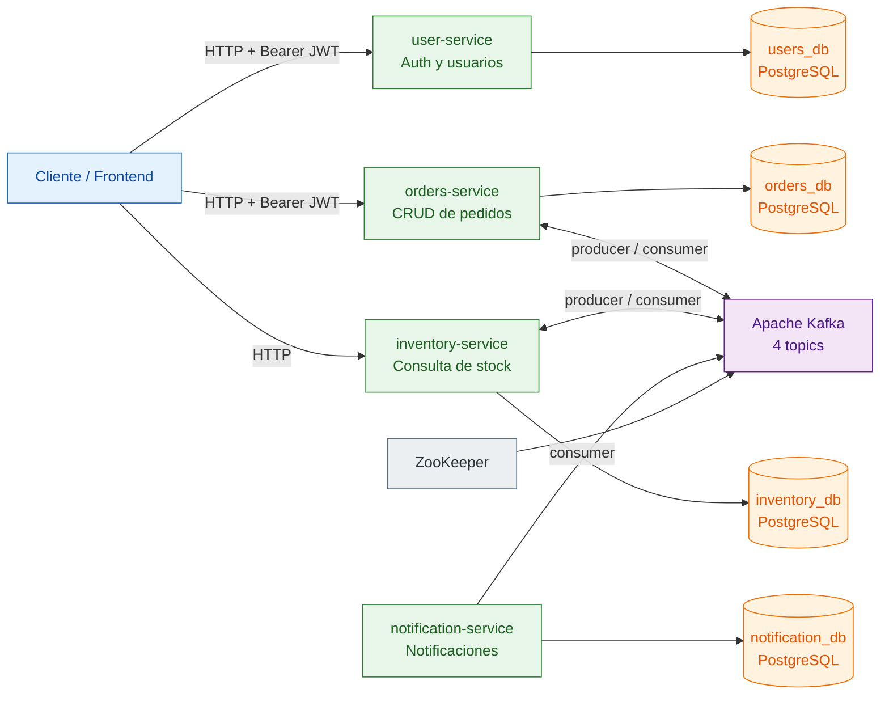

### Resumen de servicios

| Servicio | Puerto (host) | Puerto (contenedor) | Base de datos | Rol | Seguridad |
|---|---:|---:|---|---|---|
| `user-service` | 8084 | 8080 | `users_db` (host 5435) | Registro, login y gestión de usuarios | Spring Security + JWT (emisor) |
| `orders-service` | 8081 | 8080 | `orders_db` (host 5432) | Crear, consultar y cancelar pedidos | Spring Security + JWT (validador) |
| `inventory-service` | 8082 | 8080 | `inventory_db` (host 5433) | Reserva/liberación de stock y consulta pública | Sin seguridad |
| `notification-service` | 8083 | 8080 | `notification_db` (host 5434) | Persistencia del historial de notificaciones | Sin seguridad (solo actuator) |

---

## 2. Arquitectura del sistema

### 2.1 Vista de despliegue

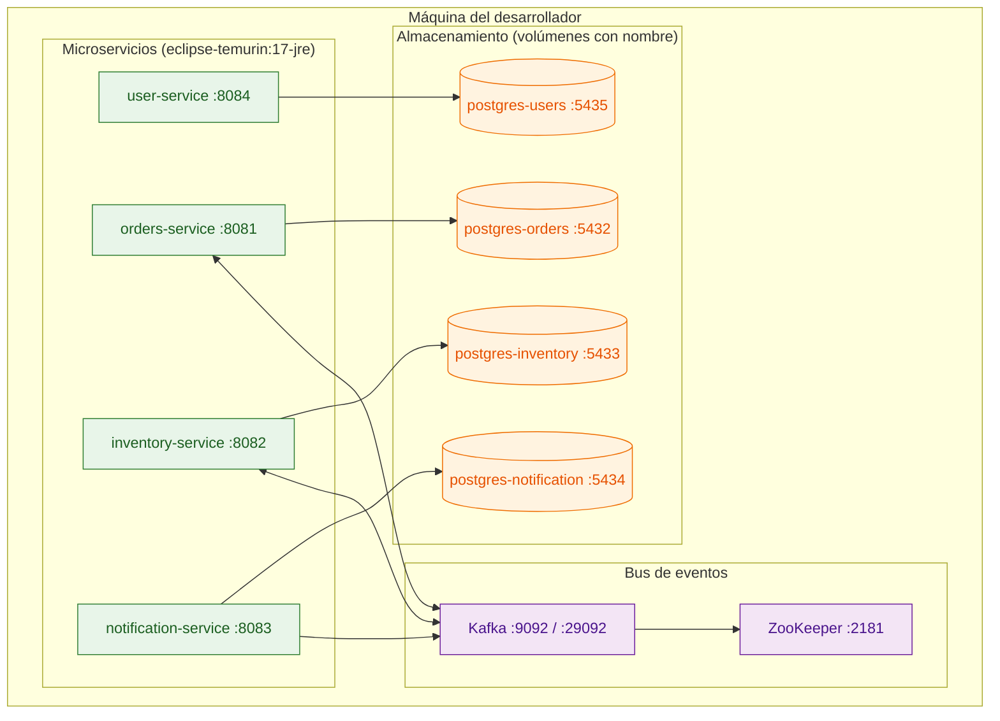

### 2.2 Vista lógica (capas de cada servicio)

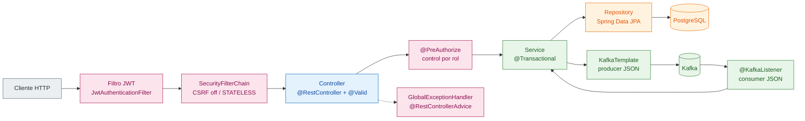

### 2.3 Patrones aplicados

| Patrón | Dónde se aplica |
|---|---|
| Database per Service | 4 instancias PostgreSQL independientes, sin tablas compartidas |
| Saga choreography | El pedido se coordina solo mediante eventos, sin orquestador central |
| Anti-corruption layer | Cada servicio declara su propio DTO de evento (`OrderEvent` duplicado por módulo) |
| Actualización condicional atómica | `OrderRepository.markStatusIfActive` (`UPDATE ... WHERE status <> :status`) |
| Pessimistic locking | `StockRepository.findByProductIdForUpdate` con `@Lock(PESSIMISTIC_WRITE)` |
| Idempotencia básica | Los listeners ignoran eventos si el estado actual ya es el deseado |
| Health check + arranque ordenado | `/actuator/health` + `depends_on: service_healthy` en Compose |
| Contrato de errores uniforme | Envelope `{timestamp, status, message}` en user y orders |

---

## 3. Tecnologías

| Categoría | Tecnología | Versión |
|---|---|---|
| Lenguaje | Java | 17 |
| Framework | Spring Boot | 3.2.5 |
| Build | Maven multi-módulo | parent `spring-boot-starter-parent` |
| Seguridad | Spring Security + JJWT | 3.2.5 / 0.12.5 |
| Persistencia | Spring Data JPA, Hibernate, PostgreSQL | driver `postgresql` (runtime) |
| Mensajería | Spring Kafka (serialización JSON) | 3.1.3 |
| Broker | Confluent Kafka + ZooKeeper | 7.5.0 |
| Base de datos | PostgreSQL | 16-alpine |
| Mapeo | MapStruct (declarado, sin uso activo) | 1.5.5.Final |
| Resiliencia | Resilience4j (configurado, sin uso activo) | 2.2.0 |
| Correo | spring-boot-starter-mail (configurado, deshabilitado) | hereda de Boot |
| Utilidades | Lombok | hereda de Boot |
| Pruebas | JUnit 5, Mockito, MockMvc, `@DataJpaTest`, H2 | hereda de Boot |
| Contenedores | Docker / Docker Compose (build multi-etapa) | Compose Spec |
| CI | GitHub Actions | `.github/workflows/ci.yml` |
| Cloud | Spring Cloud BOM (importado, sin uso activo) | 2023.0.1 |

---

## 4. Estructura del repositorio

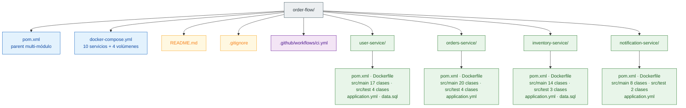

> **Totales**: 59 clases de producción + 13 clases de prueba = **72 fuentes Java** (excluyendo `target/`).

---

## 5. Módulos Maven

### 5.1 Jerarquía de módulos

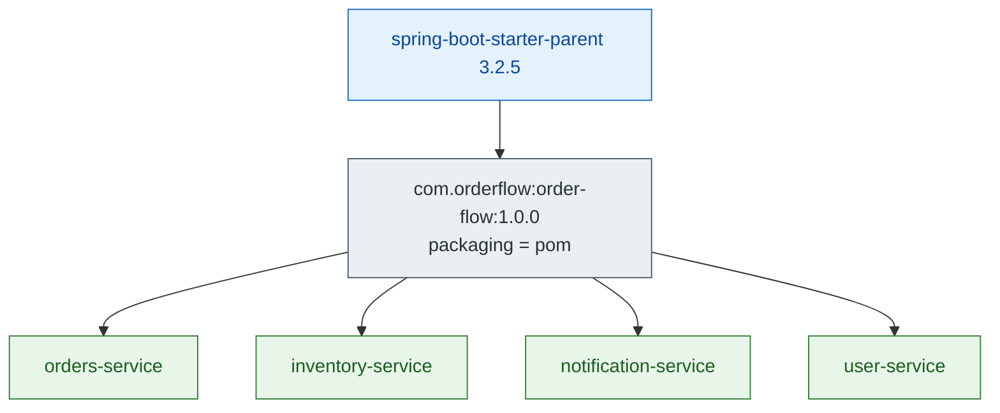

**Coordenadas raíz**: `com.orderflow:order-flow:1.0.0`, nombre `OrderFlow`, descripción *"Sistema de gestión de pedidos con microservicios"*.

**Propiedades del parent**

| Propiedad | Valor |
|---|---|
| `java.version` | 17 |
| `spring-cloud.version` | 2023.0.1 |
| `spring-kafka.version` | 3.1.3 |
| `resilience4j.version` | 2.2.0 |
| `jjwt.version` | 0.12.5 |
| `mapstruct.version` | 1.5.5.Final |

**`dependencyManagement`**: importa el BOM `spring-cloud-dependencies:2023.0.1`, fija `spring-kafka`, `resilience4j-spring-boot3` (*entrada duplicada en el archivo*), `jjwt-api` / `jjwt-impl` / `jjwt-jackson` y `mapstruct`.

**Build**: `spring-boot-maven-plugin` con exclusión de Lombok.

### 5.2 Matriz de dependencias por módulo

| Dependencia | user | orders | inventory | notification |
|---|:-:|:-:|:-:|:-:|
| `spring-boot-starter-web` | ✓ | ✓ | ✓ | ✓ |
| `spring-boot-starter-data-jpa` | ✓ | ✓ | ✓ | ✓ |
| `spring-boot-starter-security` | ✓ | ✓ | – | – |
| `spring-boot-starter-validation` | ✓ | ✓ | ✓ | – |
| `spring-boot-starter-actuator` | ✓ | ✓ | ✓ | ✓ |
| `spring-boot-starter-webflux` | – | ✓ | – | – |
| `spring-kafka` | – | ✓ | ✓ | ✓ |
| `resilience4j-spring-boot3` + `starter-aop` | – | ✓ | – | – |
| `spring-boot-starter-mail` | – | – | – | ✓ |
| `jjwt-api` / `jjwt-impl` / `jjwt-jackson` | ✓ | ✓ | – | – |
| `postgresql` (runtime) | ✓ | ✓ | ✓ | ✓ |
| `lombok` (optional) | ✓ | ✓ | ✓ | ✓ |
| `mapstruct` | – | ✓ | ✓ | – |
| `spring-boot-starter-test` (test) | ✓ | ✓ | ✓ | ✓ |
| `spring-security-test` (test) | ✓ | ✓ | – | – |
| `h2` (test) | ✓ | ✓ | ✓ | ✓ |

`orders-service` e `inventory-service` configuran `maven-compiler-plugin` con `annotationProcessorPaths` (Lombok + `mapstruct-processor`).

---

## 6. Infraestructura (Docker Compose)

### 6.1 Grafo de dependencias de arranque


### 6.2 Servicios declarados en el compose

| Servicio Compose | Imagen / Build | Puerto host → contenedor | Volumen | Condición de arranque |
|---|---|---|---|---|
| `postgres-users` | `postgres:16-alpine` | 5435 → 5432 | `postgres-users-data` | healthcheck `pg_isready` |
| `postgres-orders` | `postgres:16-alpine` | 5432 → 5432 | `postgres-orders-data` | healthcheck `pg_isready` |
| `postgres-inventory` | `postgres:16-alpine` | 5433 → 5432 | `postgres-inventory-data` | healthcheck `pg_isready` |
| `postgres-notification` | `postgres:16-alpine` | 5434 → 5432 | `postgres-notification-data` | healthcheck `pg_isready` |
| `zookeeper` | `confluentinc/cp-zookeeper:7.5.0` | 2181 → 2181 | — | `started` |
| `kafka` | `confluentinc/cp-kafka:7.5.0` | 9092, 29092 | — | `started` + healthcheck `kafka-broker-api-versions` |
| `user-service` | `build: user-service/Dockerfile` | 8084 → 8080 | — | `postgres-users: service_healthy` |
| `orders-service` | `build: orders-service/Dockerfile` | 8081 → 8080 | — | `postgres-orders` + `kafka` healthy |
| `inventory-service` | `build: inventory-service/Dockerfile` | 8082 → 8080 | — | `postgres-inventory` + `kafka` healthy |
| `notification-service` | `build: notification-service/Dockerfile` | 8083 → 8080 | — | `postgres-notification` + `kafka` healthy |

**Credenciales PostgreSQL por defecto**: usuario `orderflow`, contraseña `orderflow` (todas las bases).

**Variables de entorno inyectadas**

| Variable | Valor | Servicios |
|---|---|---|
| `SPRING_DATASOURCE_URL` | `jdbc:postgresql://postgres-<svc>:5432/<db>` | los 4 |
| `SPRING_DATASOURCE_USERNAME` / `SPRING_DATASOURCE_PASSWORD` | `orderflow` / `orderflow` | los 4 |
| `SPRING_KAFKA_BOOTSTRAP_SERVERS` | `kafka:29092` | orders, inventory, notification |
| `JWT_SECRET` | secreto HS256 de 45 caracteres | user, orders |
| `JWT_EXPIRATION` | `86400000` (24 h) | user |
| `SPRING_JPA_HIBERNATE_DDL_AUTO` | `create` | inventory, notification |

**Configuración del broker en el compose**

| Parámetro | Valor | Efecto |
|---|---|---|
| `KAFKA_ADVERTISED_LISTENERS` | `PLAINTEXT://kafka:29092`, `PLAINTEXT_HOST://localhost:9092` | in-network y host |
| `KAFKA_OFFSETS_TOPIC_REPLICATION_FACTOR` | 1 | broker único |
| `KAFKA_AUTO_CREATE_TOPICS_ENABLE` | `true` | los topics se crean automáticamente |
| `KAFKA_ZOOKEEPER_CONNECT` | `zookeeper:2181` | modo ZooKeeper (no KRaft) |

> No hay sección `networks:` (red por defecto `order-flow_default`), ni políticas `restart:`, ni `env_file:`, ni límites de recursos.

### 6.3 Dockerfile (multi-etapa, patrón idéntico en los 4 módulos)

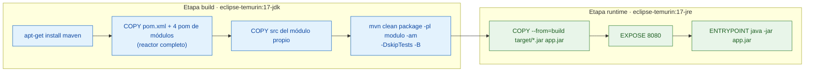

> No existe `.dockerignore`: el contexto de build incluye los directorios `target/` locales.

---

## 7. Modelo de datos

### 7.1 Base `users_db` — user-service

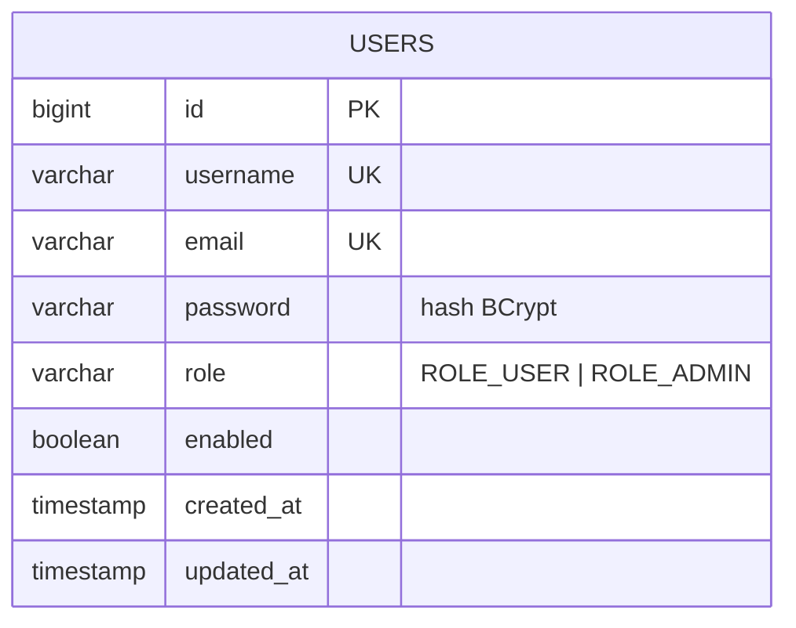

- `role` se persiste con `@Enumerated(STRING)` sobre el enum `Role`.
- `created_at` usa `@CreationTimestamp` (no editable) y `updated_at` usa `@UpdateTimestamp`.

### 7.2 Base `orders_db` — orders-service

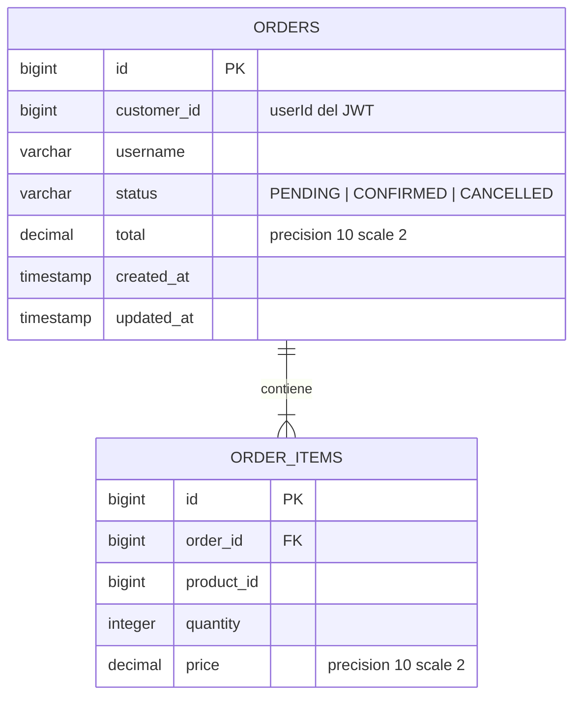

- Relación bidireccional: el lado propietario es `ORDER_ITEMS.order` (`@ManyToOne LAZY`).
- `ORDERS.items` es `@OneToMany(mappedBy, cascade = ALL, orphanRemoval = true, fetch = EAGER)`.

### 7.3 Base `inventory_db` — inventory-service


- Disponible real = `quantity_available - quantity_reserved`.
- `STOCK.product_id` tiene restricción `UNIQUE` (OneToOne con `Product`).

### 7.4 Base `notification_db` — notification-service

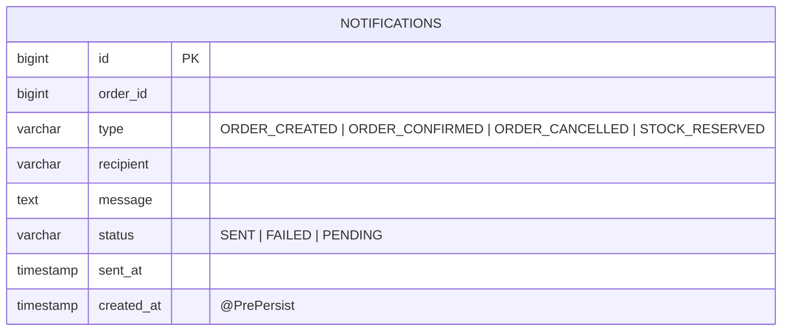

- Tabla aislada: referencia al pedido mediante el escalar `order_id`, **sin asociación JPA** hacia orders-service.

---

## 8. Dominio y lógica de negocio

### 8.1 Estructura de paquetes por servicio

```mermaid
flowchart TD
    classDef api fill:#e3f2fd,stroke:#1565c0,color:#0d47a1
    classDef biz fill:#e8f5e9,stroke:#2e7d32,color:#1b5e20
    classDef pers fill:#fff3e0,stroke:#ef6c00,color:#e65100
    classDef sec fill:#fce4ec,stroke:#ad1457,color:#880e4f
    classDef evt fill:#f3e5f5,stroke:#6a1b9a,color:#4a148c

    subgraph US["com.orderflow.user"]
        U1["controller/UserController"]:::api
        U2["service/UserService<br/>service/CustomUserDetailsService"]:::biz
        U3["repository/UserRepository"]:::pers
        U4["domain/User · Role"]:::pers
        U5["security/JwtUtil · JwtAuthenticationFilter<br/>config/SecurityConfig"]:::sec
        U6["dto/* · exception/*"]:::api
        U1 --> U2 --> U3 --> U4
        U5 --> U1
        U6 --> U1
    end

    subgraph OS["com.orderflow.orders"]
        O1["controller/OrderController"]:::api
        O2["service/OrderService"]:::biz
        O3["repository/OrderRepository"]:::pers
        O4["domain/Order · OrderItem · OrderStatus"]:::pers
        O5["security/* · config/SecurityConfig"]:::sec
        O6["event/OrderEventPublisher"]:::evt
        O7["listener/StockEventListener"]:::evt
        O1 --> O2 --> O3 --> O4
        O2 --> O6
        O7 --> O2
        O5 --> O1
    end

    subgraph IS["com.orderflow.inventory"]
        I1["controller/InventoryController"]:::api
        I2["service/InventoryService"]:::biz
        I3["repository/ProductRepository<br/>StockRepository · StockReservationRepository"]:::pers
        I4["domain/Product · Stock · StockReservation"]:::pers
        I5["event/StockEventPublisher"]:::evt
        I6["listener/OrderCreatedListener<br/>OrderCancelledListener"]:::evt
        I1 --> I2 --> I3 --> I4
        I2 --> I5
        I6 --> I2
    end

    subgraph NS["com.orderflow.notification"]
        N1["sin controller"]:::api
        N2["service/NotificationService"]:::biz
        N3["repository/NotificationRepository"]:::pers
        N4["domain/Notification · NotificationType · NotificationStatus"]:::pers
        N5["listener/OrderEventListener"]:::evt
        N5 --> N2 --> N3 --> N4
    end
```

### 8.2 user-service

| Clase | Responsabilidad |
|---|---|
| `UserService` | `register` (valida unicidad, hashea BCrypt, genera JWT), `login` (vía `AuthenticationManager`), consultas de usuario |
| `CustomUserDetailsService` | Adaptador a `UserDetailsService`; expone `role` como autoridad y `enabled` como `disabled` |
| `JwtUtil` | Firma/validación HS256, claims `sub`, `role`, `userId`, `iat`, `exp`; rechaza tokens no canónicos y `alg:none` |
| `JwtAuthenticationFilter` | Extrae `Authorization: Bearer`, valida y coloca el **username (`String`)** como principal |
| `SecurityConfig` | Cadena stateless, rutas públicas, `BCryptPasswordEncoder`, `AuthenticationManager` |
| `GlobalExceptionHandler` | Envelope `{timestamp, status, message \| errors}` |

**Reglas de negocio**

- Registro rechaza username y email duplicados con `409`.
- Todo usuario nuevo nace con `ROLE_USER` y `enabled = true`.
- Validaciones: username 3–50 caracteres, email formato válido, contraseña mínimo 6 caracteres.

### 8.3 orders-service

| Clase | Responsabilidad |
|---|---|
| `OrderService` | Crear, consultar, cancelar y reaccionar a eventos de stock |
| `OrderEventPublisher` | Publica `order-created` y `order-cancelled` con clave `orderId` |
| `StockEventListener` | Consume `stock-reserved` y `stock-rejected` (grupo `orders-service`) |
| `OrderRepository.markStatusIfActive` | Transición de estado condicional y atómica |
| `AuthenticatedUser` | `record(id, username, role)` como principal del security context |

**Reglas de negocio**

- El precio unitario está **fijado en código a `99.99`** (no existe catálogo de precios).
- `total = Σ (price × quantity)`.
- Crear un pedido lo deja en `PENDING` y publica `order-created`.
- `handleStockReserved`: si el pedido está `CANCELLED` se ignora (idempotencia); si no, pasa a `CONFIRMED`.
- `handleStockRejected`: si ya está `CANCELLED` se ignora; si no, se pone `CANCELLED` y publica `order-cancelled` para que inventory libere reservas.
- `cancelOrder`: doble comprobación (lectura + `UPDATE ... WHERE status <> 'CANCELLED'`) para ganar carreras; si afecta `0` filas → `409`.
- Autorización: sólo el dueño del pedido o un `ROLE_ADMIN` pueden leerlo o cancelarlo.

### 8.4 inventory-service

| Clase | Responsabilidad |
|---|---|
| `InventoryService.processOrderCreated` | Agrega demanda por producto, valida con bloqueo pesimista, reserva o rechaza |
| `InventoryService.releaseReservations` | Libera stock y borra reservas al recibir `order-cancelled` |
| `InventoryService.getAvailableStock` | `quantityAvailable - quantityReserved`, o `0` si no existe |
| `StockRepository.findByProductIdForUpdate` | `@Lock(PESSIMISTIC_WRITE)` a nivel de fila |
| `StockEventPublisher` | Publica `stock-reserved` y `stock-rejected` |

**Algoritmo de reserva**

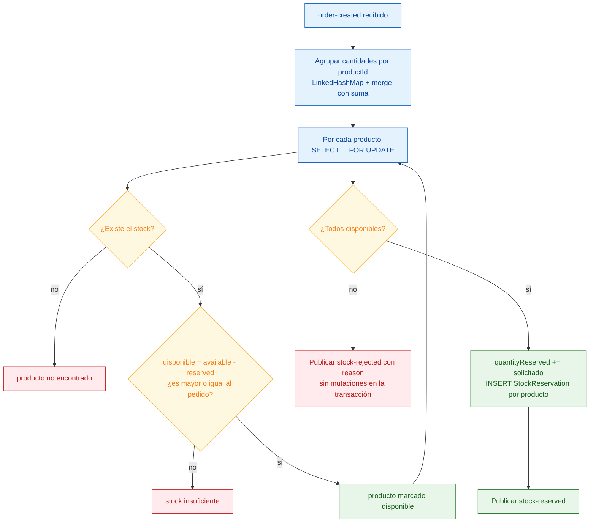

> Si algún producto falla, la transacción aún no ha escrito nada, por lo que el rechazo se confirma sin efectos secundarios.

### 8.5 notification-service

Sin controladores: sólo `@KafkaListener` y persistencia.

| Evento | Método | Tipo persistido | Destinatario simulado | Mensaje |
|---|---|---|---|---|
| `order-created` | `sendOrderCreatedNotification` | `ORDER_CREATED` | `customer-<id>@orderflow.com` | `Pedido #<id> creado exitosamente por el cliente <id>` |
| `order-cancelled` | `sendOrderCancelledNotification` | `ORDER_CANCELLED` | `customer-<id>@orderflow.com` | `Pedido #<id> del cliente <id> ha sido cancelado` |
| `stock-reserved` | `sendStockReservedNotification` | `ORDER_CONFIRMED` | `inventory@orderflow.com` | `Pedido #<id> confirmado - stock reservado exitosamente` |

Todas se guardan con `status = SENT` y `sentAt = now`. El envío real por SMTP está **deshabilitado** (`notification.email.enabled: false`).

---

## 9. Autenticación y autorización (JWT)

### 9.1 Ciclo de autenticación

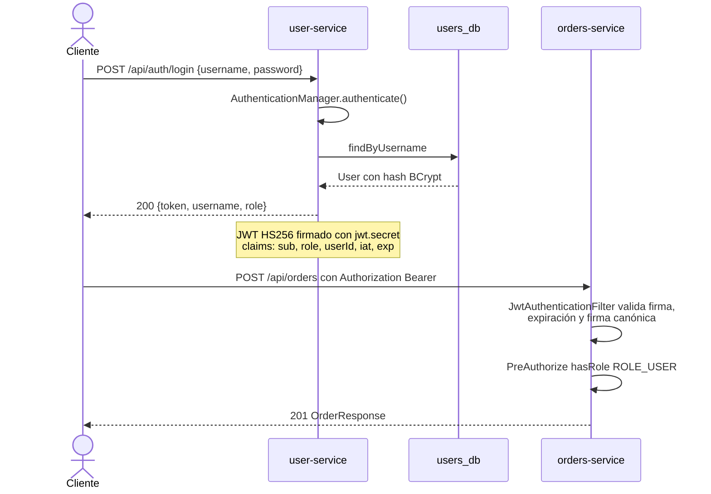

### 9.2 Especificación del token

| Atributo | Valor |
|---|---|
| Algoritmo | HS256 (`Keys.hmacShaKeyFor`) |
| Secreto | `mySecretKeyThatIsAtLeast32BytesLongForHS256Algorithm!` (idéntico en user y orders) |
| Expiración | `jwt.expiration = 86400000` ms (24 h), sólo al emitir |
| Claims | `sub` = username, `role`, `userId`, `iat`, `exp` |
| Protecciones | Rechaza tokens con más de 3 segmentos, firma no canónica (malleability), `alg:none`, secreto incorrecto y token expirado |

### 9.3 Diferencias entre emisor y validador

| Aspecto | user-service | orders-service |
|---|---|---|
| Rol en el proyecto | Emisor + validador propio | Validador externo (sin endpoint de login) |
| Principal del `SecurityContext` | `String` (username) | `AuthenticatedUser(id, username, role)` |
| `userId` en el filtro | opcional | **obligatorio**: si es `null` no autentica |
| Lectura del claim `userId` | `Number.longValue()` | `Long.class` directo |
| `jwt.expiration` | usado para firmar | no configurado (sólo valida) |
| `PasswordEncoder` / `AuthenticationManager` | presentes | ausentes |

### 9.4 Árbol de decisiones de autorización

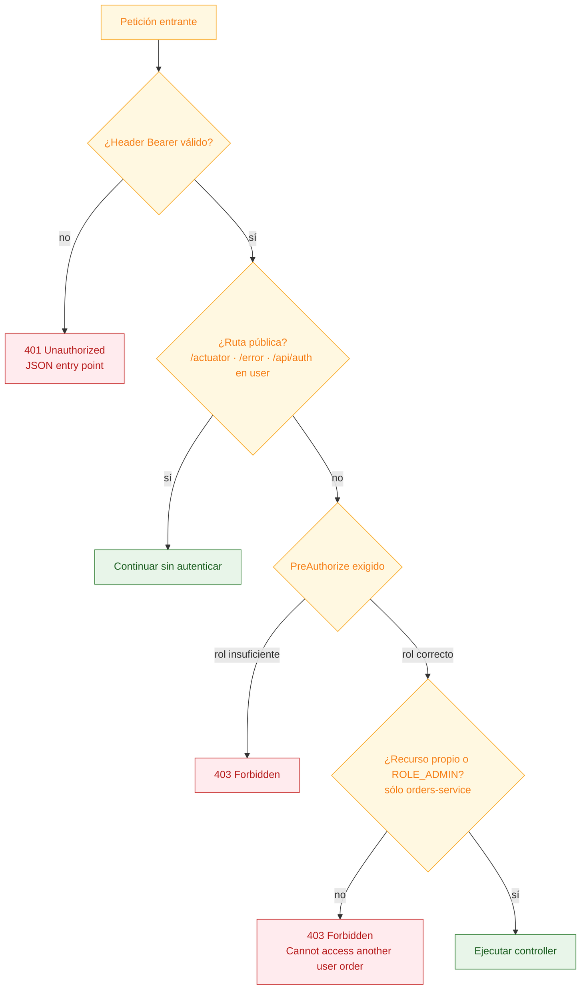

> `inventory-service` y `notification-service` **no dependen de Spring Security**: sus endpoints (si los hay) y el actuator quedan abiertos.

### 9.5 Matriz de rutas y roles

| Servicio | Ruta | Método | Acceso |
|---|---|---|---|
| user | `/api/auth/register` | POST | público |
| user | `/api/auth/login` | POST | público |
| user | `/api/users/me` | GET | `ROLE_USER` |
| user | `/api/users/{id}` | GET | `ROLE_USER` |
| user | `/api/users` | GET | `ROLE_ADMIN` |
| user | `/actuator/**`, `/error` | GET | público |
| orders | `/api/orders` | POST | `ROLE_USER` |
| orders | `/api/orders/{id}` | GET | `ROLE_USER` + dueño o `ROLE_ADMIN` |
| orders | `/api/orders` | GET | `ROLE_USER` (lista propia) |
| orders | `/api/orders/{id}/cancel` | PUT | `ROLE_USER` + dueño o `ROLE_ADMIN` |
| orders | `/actuator/**`, `/error` | GET | público |
| inventory | `/api/inventory/{productId}/stock` | GET | abierto (sin seguridad) |
| notification | — | — | sin endpoints HTTP |

---

## 10. API REST

### 10.1 user-service — `http://localhost:8084`

| Método | Ruta | Body | Respuesta | Códigos |
|---|---|---|---|---|
| POST | `/api/auth/register` | `RegisterRequest` | `AuthResponse` | 201, 400, 409 |
| POST | `/api/auth/login` | `LoginRequest` | `AuthResponse` | 200, 400, 401 |
| GET | `/api/users/{id}` | — | `UserResponse` | 200, 400, 401, 403, 404 |
| GET | `/api/users` | — | `List<UserResponse>` | 200, 401, 403 |
| GET | `/api/users/me` | — | `UserResponse` | 200, 401, 403 |

**DTOs**

```json
// RegisterRequest
{ "username": "alice", "email": "alice@orderflow.com", "password": "secret123" }

// LoginRequest
{ "username": "alice", "password": "secret123" }

// AuthResponse
{ "token": "eyJhbGciOi...", "username": "alice", "role": "ROLE_USER" }

// UserResponse
{ "id": 3, "username": "alice", "email": "alice@orderflow.com",
  "role": "ROLE_USER", "enabled": true, "createdAt": "2026-09-23T19:15:00" }
```

**Validaciones**: `username` 3–50 caracteres, `email` formato, `password` ≥ 6, campos obligatorios.

### 10.2 orders-service — `http://localhost:8081`

| Método | Ruta | Body | Respuesta | Códigos |
|---|---|---|---|---|
| POST | `/api/orders` | `CreateOrderRequest` | `OrderResponse` | 201, 400, 401, 403 |
| GET | `/api/orders/{id}` | — | `OrderResponse` | 200, 400, 401, 403, 404 |
| GET | `/api/orders` | — | `List<OrderResponse>` | 200, 401, 403 |
| PUT | `/api/orders/{id}/cancel` | — | `OrderResponse` | 200, 401, 403, 404, 409 |

**DTOs**

```json
// CreateOrderRequest
{ "items": [ { "productId": 1, "quantity": 2 }, { "productId": 3, "quantity": 1 } ] }

// OrderResponse
{ "id": 10, "customerId": 3, "username": "alice", "status": "PENDING",
  "total": 299.97,
  "items": [ { "id": 1, "productId": 1, "quantity": 2, "price": 99.99 } ],
  "createdAt": "2026-09-23T19:20:00", "updatedAt": "2026-09-23T19:20:00" }
```

**Validaciones**: `items` no vacío, `productId` nulo/negativo rechazado, `quantity` nula o no positiva rechazada.

### 10.3 inventory-service — `http://localhost:8082`

| Método | Ruta | Respuesta | Códigos |
|---|---|---|---|
| GET | `/api/inventory/{productId}/stock` | `{"productId": 3, "availableQuantity": 150}` | 200, 400 (id no numérico) |

### 10.4 notification-service — `http://localhost:8083`

Sin endpoints de negocio. Sólo expone `/actuator/health` y `/actuator/info`.

---

## 11. Mensajería asíncrona (Kafka)

### 11.1 Topología de topics


### 11.2 Contrato de eventos

| Topic | Productor | Clave | Payload | Consumidores (grupo) |
|---|---|---|---|---|
| `order-created` | orders `OrderEventPublisher` | `orderId` | `OrderEvent` | inventory (`inventory-service`), notification (`notification-service`) |
| `order-cancelled` | orders `OrderEventPublisher` | `orderId` | `OrderEvent` | inventory (`inventory-service`), notification (`notification-service`) |
| `stock-reserved` | inventory `StockEventPublisher` | `orderId` | `StockEvent` | orders (`orders-service`), notification (`notification-service`) |
| `stock-rejected` | inventory `StockEventPublisher` | `orderId` | `StockEvent` | orders (`orders-service`) |

**Esquema de payloads**

```json
// OrderEvent (publicado por orders-service, incluye username)
{ "orderId": 10, "customerId": 3, "username": "alice",
  "items": [ { "productId": 1, "quantity": 2 } ],
  "timestamp": "2026-09-23T19:20:00" }

// StockEvent
{ "orderId": 10, "reason": "Insufficient stock for product 4. Available: 30, Requested: 50.",
  "timestamp": "2026-09-23T19:20:01" }
```

### 11.3 Serialización

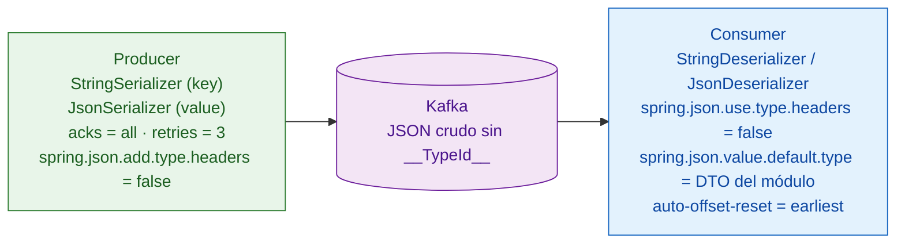

Cada servicio declara su **propia** clase `OrderEvent`, por lo que el tipo se resuelve por configuración (`spring.json.value.default.type`) y no por cabeceras.

### 11.4 Nota de compatibilidad de contratos

- El `OrderEvent` de orders-service incluye `username`; las copias de inventory y notification **no lo declaran** (campo ignorado al deserializar).
- notification-service deserializa `stock-reserved` (un `StockEvent`) usando su tipo `OrderEvent`: coinciden `orderId` y `timestamp`, `reason` se descarta y `customerId` queda a `null`.

---

## 12. Flujos de negocio

### 12.1 Ciclo de vida de un pedido

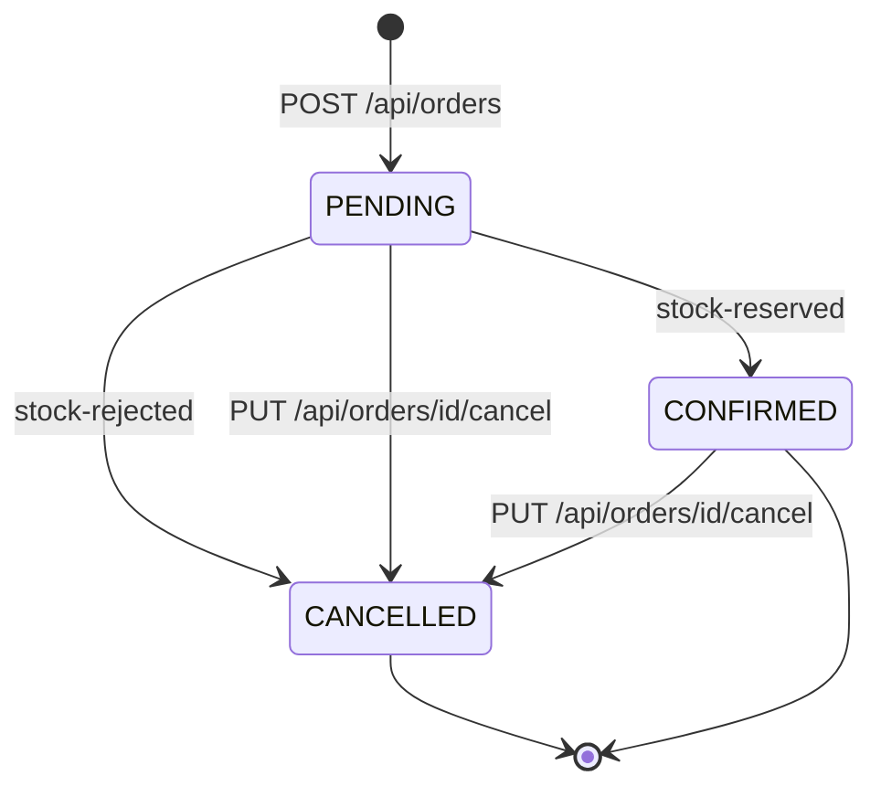

### 12.2 Happy path: creación y confirmación

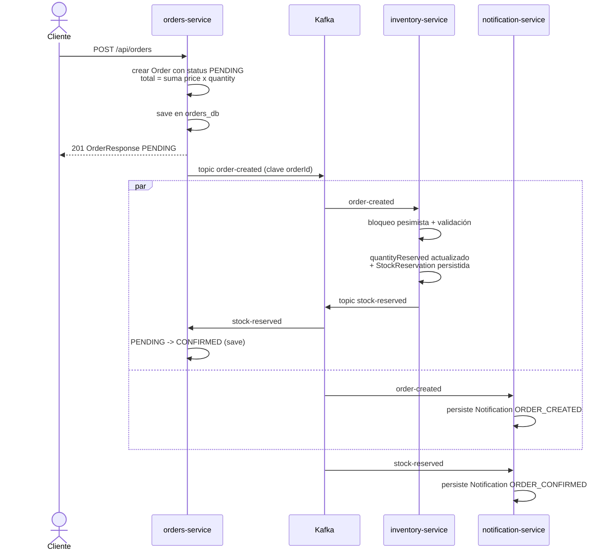

### 12.3 Rama de rechazo por stock insuficiente


### 12.4 Cancelación por el usuario

```mermaid
sequenceDiagram
    actor C as Cliente
    participant OS as orders-service
    participant K as Kafka
    participant IS as inventory-service
    participant NS as notification-service

    C->>OS: PUT /api/orders/10/cancel
    OS->>OS: verificar propiedad del pedido
    OS->>OS: UPDATE status = CANCELLED<br/>WHERE status <> CANCELLED
    alt filas afectadas = 0
        OS-->>C: 409 IllegalOrderStateException
    else filas afectadas = 1
        OS->>K: order-cancelled
        OS-->>C: 200 OrderResponse CANCELLED
        par
            K->>IS: order-cancelled
            IS->>IS: quantityReserved reducido<br/>+ borrado de StockReservation
        and
            K->>NS: order-cancelled
            NS->>NS: persiste Notification ORDER_CANCELLED
        end
    end
```

### 12.5 Liberación de stock

```mermaid
flowchart TD
    classDef in fill:#e3f2fd,stroke:#1565c0,color:#0d47a1
    classDef ok fill:#e8f5e9,stroke:#2e7d32,color:#1b5e20
    classDef db fill:#fff3e0,stroke:#ef6c00,color:#e65100

    A["order-cancelled recibido"]:::in --> B["findByOrderId en stock_reservations"]:::in
    B --> C{"¿Hay reservas?"}:::in
    C -->|"no"| F["sin efecto"]:::ok
    C -->|"sí"| D["Para cada reserva:<br/>quantityReserved -= min(reservado, cantidad)"]:::in
    D --> E[("UPDATE stock")]:::db
    E --> G[("DELETE stock_reservations")]:::db
    G --> F
```

---

## 13. Manejo de errores

### 13.1 Envelope estándar

```mermaid
flowchart LR
    classDef a fill:#e3f2fd,stroke:#1565c0,color:#0d47a1
    classDef b fill:#ffebee,stroke:#c62828,color:#b71c1c

    Req["Petición inválida"]:::a --> Exh["GlobalExceptionHandler<br/>@RestControllerAdvice"]:::a
    Exh --> B1["Validación de campos<br/>{timestamp, status: 400, errors}"]:::b
    Exh --> B2["Recurso inexistente<br/>{timestamp, status: 404, message}"]:::b
    Exh --> B3["Conflicto de estado o recurso<br/>{timestamp, status: 409, message}"]:::b
    Exh --> B4["No autenticado / denegado<br/>{timestamp, status: 401 o 403, message}"]:::b
    Exh --> B5["Error inesperado<br/>{timestamp, status: 500, message}"]:::b
```

**Ejemplo de cuerpo**

```json
{
  "timestamp": "2026-09-23T19:20:00",
  "status": 400,
  "message": "Validation failed",
  "errors": { "items[0].quantity": "Quantity must be positive" }
}
```

### 13.2 Matriz de códigos por servicio

| Condición | user-service | orders-service | inventory | notification |
|---|---|---|---|---|
| Validación `@Valid` fallida | 400 + `errors` | 400 + `errors` | 400 (default) | n/a |
| Body malformado / ilegible | 400 | 400 | 400 (default) | n/a |
| Tipo de parámetro inválido | 400 | 400 | 400 (default) | n/a |
| Método HTTP no soportado | 405 (default) | 405 explícito | 405 (default) | 405 (default) |
| Content-Type no soportado | 415 (default) | 415 explícito | 415 (default) | 415 (default) |
| No autenticado | 401 JSON propio | 401 JSON propio | — (abierto) | — |
| Rol insuficiente | 403 | 403 | — | — |
| Recurso inexistente | 404 `UserNotFoundException` | 404 `OrderNotFoundException` | — | — |
| Username/email duplicado | 409 `UserAlreadyExistsException` | — | — | — |
| Estado de pedido inválido | — | 409 `IllegalOrderStateException` | — | — |
| Error inesperado | 500 (`RuntimeException`) | 500 (`RuntimeException`) | 500 (default) | 500 (default) |

**Excepciones personalizadas**

| Servicio | Excepción | HTTP | Mensaje |
|---|---|---|---|
| user | `UserNotFoundException` | 404 | `User not found: <id o username>` |
| user | `UserAlreadyExistsException` | 409 | `Username already exists: <u>` / `Email already exists: <e>` |
| orders | `OrderNotFoundException` | 404 | `Order not found: <id>` |
| orders | `IllegalOrderStateException` | 409 | `Order <id> is already cancelled` |

---

## 14. Configuración

### 14.1 Archivos de configuración

```mermaid
flowchart TD
    classDef main fill:#e3f2fd,stroke:#1565c0,color:#0d47a1
    classDef test fill:#fff8e1,stroke:#f9a825,color:#f57f17
    classDef env fill:#e8f5e9,stroke:#2e7d32,color:#1b5e20

    Y["application.yml<br/>(por módulo, puerto 8080)"]:::main --> OVR["Variables de entorno del compose<br/>SPRING_* · JWT_*"]:::env
    YT["application-test.yml<br/>perfil test con H2 en memoria"]:::test --> T["@ActiveProfiles test<br/>en las clases de prueba"]:::test
    OVR --> RUN["Runtime del contenedor"]:::env
```

### 14.2 Claves principales por módulo

| Clave | user | orders | inventory | notification |
|---|---|---|---|---|
| `server.port` | 8080 | 8080 | 8080 | 8080 |
| `spring.datasource.url` | `localhost:5432/users_db` | `localhost:5432/orders_db` | `localhost:5432/inventory_db` | `localhost:5432/notification_db` |
| `spring.jpa.hibernate.ddl-auto` | `update` | `update` | `update` (compose: `create`) | `update` (compose: `create`) |
| `spring.jpa.show-sql` | true | true | true | true |
| `defer-datasource-initialization` | true | — | true | — |
| `spring.sql.init.mode` | `always` | — | `always` | — |
| `spring.sql.init.continue-on-error` | true | — | — | — |
| `spring.kafka.bootstrap-servers` | — | `localhost:9092` | `localhost:9092` | `localhost:9092` |
| `spring.kafka.consumer.group-id` | — | `orders-service` | `inventory-service` | `notification-service` |
| `spring.kafka.consumer.spring.json.value.default.type` | — | `...orders.dto.StockEvent` | `...inventory.dto.OrderEvent` | `...notification.dto.OrderEvent` |
| `jwt.secret` | ✓ | ✓ | — | — |
| `jwt.expiration` | 86400000 | — | — | — |
| `spring.mail.*` | — | — | — | `smtp.gmail.com:587` |
| `notification.email.enabled` | — | — | — | `false` |
| `resilience4j.circuitbreaker.instances.inventoryService` | — | ✓ (sin uso en código) | — | — |
| `management.endpoints.web.exposure.include` | `health,info` | `health,info` | `health,info` | `health,info` |

> **Aviso**: el `application.yml` de user-service apunta a `localhost:5432/users_db`, pero el compose publica esa base en el puerto **5435** (5432 pertenece a orders). Al ejecutar localmente sin Docker hay que sobreescribir `SPRING_DATASOURCE_URL`.

### 14.3 Perfil de pruebas

Los 4 módulos definen `src/test/resources/application-test.yml`:

| Clave | Valor |
|---|---|
| `spring.datasource.url` | `jdbc:h2:mem:testdb;DB_CLOSE_DELAY=-1` |
| `spring.datasource.username` / `password` | `sa` / vacío |
| `spring.jpa.hibernate.ddl-auto` | `create-drop` |
| `spring.jpa.database-platform` | `org.hibernate.dialect.H2Dialect` |
| `spring.sql.init.mode` | `never` (sólo en user e inventory) |

---

## 15. Datos semilla

### 15.1 user-service — `src/main/resources/data.sql`

| username | email | rol | contraseña |
|---|---|---|---|
| `admin` | `admin@orderflow.com` | `ROLE_ADMIN` | `password` |
| `user` | `user@orderflow.com` | `ROLE_USER` | `password` |

Ambos se insertan con el mismo hash BCrypt (`$2a$10$sZmX1dJyR5cp7BLv7W8RvezamttWVaQE/Y4uMb46vjcoAcJWwVMf.`) y `enabled = true`. Se ejecuta con `spring.sql.init.mode: always` + `defer-datasource-initialization: true` y `continue-on-error: true` (repeticiones seguras con `ddl-auto: update`).

### 15.2 inventory-service — `src/main/resources/data.sql`

```mermaid
flowchart LR
    classDef p fill:#e8f5e9,stroke:#2e7d32,color:#1b5e20
    classDef s fill:#fff3e0,stroke:#ef6c00,color:#e65100

    P1["1 Laptop HP<br/>LAP-HP-001"]:::p --> S1["stock 50"]:::s
    P2["2 Mouse Logitech<br/>MOU-LOG-001"]:::p --> S2["stock 200"]:::s
    P3["3 Teclado Mecánico<br/>KEY-MEC-001"]:::p --> S3["stock 150"]:::s
    P4["4 Monitor Samsung<br/>MON-SAM-001"]:::p --> S4["stock 30"]:::s
    P5["5 Auriculares Sony<br/>AUD-SON-001"]:::p --> S5["stock 100"]:::s
    P6["6 Webcam Logitech<br/>WEC-LOG-001"]:::p --> S6["stock 80"]:::s
    P7["7 Disco SSD Samsung<br/>SSD-SAM-001"]:::p --> S7["stock 120"]:::s
    P8["8 Memoria RAM Kingston<br/>RAM-KIN-001"]:::p --> S8["stock 200"]:::s
    P9["9 Cable HDMI<br/>CAB-HDM-001"]:::p --> S9["stock 500"]:::s
    P10["10 Mousepad XL<br/>MPA-XL-001"]:::p --> S10["stock 300"]:::s
```

Todos nacen con `quantity_reserved = 0`. En el compose este servicio arranca con `ddl-auto: create`, por lo que el seed se regenera limpiamente tras `docker compose down -v`.

---

## 16. Inicio rápido

### 16.1 Requisitos

| Requisito | Versión |
|---|---|
| Docker + Docker Compose | 20.10+ / Compose v2 |
| (alternativa local) JDK | 17 |
| (alternativa local) Maven | 3.9+ |
| (alternativa local) PostgreSQL y Kafka | 16 y 3.x |

### 16.2 Arranque completo (recomendado)

```bash
docker compose up --build -d
docker compose ps
```

```mermaid
flowchart LR
    classDef a fill:#e3f2fd,stroke:#1565c0,color:#0d47a1
    classDef b fill:#e8f5e9,stroke:#2e7d32,color:#1b5e20

    A["docker compose up --build -d"]:::a --> B["Postgres x4 + ZooKeeper + Kafka"]:::a
    B --> C["user :8084 · orders :8081<br/>inventory :8082 · notification :8083"]:::b
    C --> D["Verificar:<br/>curl localhost:8084/actuator/health"]:::b
```

### 16.3 URLs de salud

| Servicio | URL |
|---|---|
| user-service | `http://localhost:8084/actuator/health` |
| orders-service | `http://localhost:8081/actuator/health` |
| inventory-service | `http://localhost:8082/actuator/health` |
| notification-service | `http://localhost:8083/actuator/health` |

### 16.4 Comandos útiles

```bash
# Ver logs de un servicio
docker compose logs -f orders-service

# Parar todo conservando datos
docker compose down

# Parar todo y borrar volúmenes (regenera los seeds)
docker compose down -v

# Reconstruir una sola imagen
docker compose build orders-service

# Ejecutar los tests sin Docker
mvn -ntp clean test

# Empaquetar un módulo concreto
mvn -pl user-service -am clean package -DskipTests
```

### 16.5 Ejecución local sin Docker

```mermaid
sequenceDiagram
    participant D as Desarrollador
    participant PG as PostgreSQL local
    participant K as Kafka local
    participant M as Maven

    D->>PG: crear bases users_db, orders_db,<br/>inventory_db, notification_db
    D->>K: arrancar broker en localhost:9092
    D->>M: mvn -pl user-service -am spring-boot:run
    Note over D,M: sobreescribir SPRING_DATASOURCE_URL<br/>porque user-service espera el puerto 5435
    D->>M: mvn -pl orders-service -am spring-boot:run
    D->>M: mvn -pl inventory-service -am spring-boot:run
    D->>M: mvn -pl notification-service -am spring-boot:run
```

---

## 17. Ejemplos con curl

```bash
# 1) Login
TOKEN=$(curl -s -X POST http://localhost:8084/api/auth/login \
  -H "Content-Type: application/json" \
  -d '{"username":"user","password":"password"}' | jq -r .token)

# 2) Registro
curl -s -X POST http://localhost:8084/api/auth/register \
  -H "Content-Type: application/json" \
  -d '{"username":"alice","email":"alice@orderflow.com","password":"secret123"}'

# 3) Perfil propio
curl -s http://localhost:8084/api/users/me -H "Authorization: Bearer $TOKEN"

# 4) Crear pedido
curl -s -X POST http://localhost:8081/api/orders \
  -H "Content-Type: application/json" \
  -H "Authorization: Bearer $TOKEN" \
  -d '{"items":[{"productId":1,"quantity":2},{"productId":3,"quantity":1}]}'

# 5) Consultar pedido
curl -s http://localhost:8081/api/orders/1 -H "Authorization: Bearer $TOKEN"

# 6) Listar mis pedidos
curl -s http://localhost:8081/api/orders -H "Authorization: Bearer $TOKEN"

# 7) Cancelar pedido
curl -s -X PUT http://localhost:8081/api/orders/1/cancel \
  -H "Authorization: Bearer $TOKEN"

# 8) Consultar stock disponible
curl -s http://localhost:8082/api/inventory/1/stock

# 9) Salud de los servicios
for p in 8084 8081 8082 8083; do curl -s localhost:$p/actuator/health; done
```

---

## 18. Pruebas

### 18.1 Estrategia

```mermaid
flowchart TD
    classDef unit fill:#e3f2fd,stroke:#1565c0,color:#0d47a1
    classDef web fill:#f3e5f5,stroke:#6a1b9a,color:#4a148c
    classDef repo fill:#fff3e0,stroke:#ef6c00,color:#e65100
    classDef sec fill:#fce4ec,stroke:#ad1457,color:#880e4f

    T["mvn clean verify"] --> A["Unitarias con Mockito<br/>services y JwtUtil"]:::unit
    T --> B["Slice web con MockMvc<br/>controllers + seguridad"]:::web
    T --> C["@DataJpaTest con H2<br/>repositorios y queries"]:::repo
    T --> D["Seguridad JWT<br/>firma, expiración, alg:none"]:::sec
    A --> E["Perfil test: H2 en memoria<br/>ddl-auto create-drop"]:::repo
    B --> E
    C --> E
    D --> E
```

### 18.2 Inventario de pruebas

| Módulo | Clase de prueba | Tipo | Nº |
|---|---|---|---:|
| user | `UserControllerIntegrationTest` | `@SpringBootTest` + MockMvc | 13 |
| user | `JwtUtilTest` | unitaria JWT | 7 |
| user | `UserServiceTest` | Mockito | 6 |
| user | `UserRepositoryTest` | `@DataJpaTest` | 2 |
| orders | `OrderControllerWebMvcTest` | `@WebMvcTest` + seguridad | 13 |
| orders | `OrderServiceTest` | Mockito | 9 |
| orders | `JwtUtilTest` | unitaria JWT | 7 |
| orders | `OrderRepositoryTest` | `@DataJpaTest` | 3 |
| inventory | `InventoryServiceTest` | Mockito | 7 |
| inventory | `InventoryControllerWebMvcTest` | `@WebMvcTest` | 2 |
| inventory | `StockRepositoryTest` | `@DataJpaTest` | 1 |
| notification | `NotificationServiceTest` | Mockito | 3 |
| notification | `NotificationRepositoryTest` | `@DataJpaTest` | 2 |
| **Total** | **13 clases** | | **75** |

### 18.3 Casos cubiertos por área

```mermaid
mindmap
  root(("75 tests"))
    Autenticación
      Registro duplicado 409
      Login y password incorrecta 401
      Token propio vs ajeno
      Token manipulado / expirado / alg none
      Roles USER y ADMIN
    Pedidos
      Cálculo del total
      Publicación de order-created
      Cancelación única
      Carrera en la cancelación
      Confirmación y rechazo por stock
    Inventario
      Agregación de duplicados
      Reserva con lock pesimista
      Stock insuficiente y producto inexistente
      Liberación de reservas
    Notificaciones
      Persistencia de ORDER_CREATED
      ORDER_CANCELLED y ORDER_CONFIRMED
      Marca createdAt en PrePersist
```

### 18.4 Ejecución

```bash
mvn -ntp clean test            # todos los módulos
mvn -ntp -pl user-service test # un módulo concreto
mvn -B -ntp clean verify       # como en CI (incluye package)
```

Los informes se generan en `*/target/surefire-reports/`.

---

## 19. CI/CD (GitHub Actions)

### 19.1 Pipeline

```mermaid
flowchart LR
    classDef trig fill:#eceff1,stroke:#455a64,color:#263238
    classDef job fill:#e3f2fd,stroke:#1565c0,color:#0d47a1
    classDef art fill:#fff8e1,stroke:#f9a825,color:#f57f17
    classDef img fill:#e8f5e9,stroke:#2e7d32,color:#1b5e20

    E1["push a main"]:::trig --> J1
    E2["pull request a main"]:::trig --> J1
    subgraph J1["Job: test · Build y tests"]
        direction TB
        T1["actions/checkout@v4"]:::job
        T2["actions/setup-java@v4<br/>temurin 17 + caché maven"]:::job
        T3["mvn -B -ntp clean verify"]:::job
        T1 --> T2 --> T3
    end
    T3 --> U["upload-artifact surefire-reports<br/>if: always()"]:::art
    J1 -->|"needs: test"| J2
    subgraph J2["Job: docker · Build de imágenes"]
        direction TB
        D1["docker build user-service"]:::img
        D2["docker build orders-service"]:::img
        D3["docker build inventory-service"]:::img
        D4["docker build notification-service"]:::img
    end
    J2 --> TAG["orderflow-*-service:ci"]:::img
```

| Job | Runner | Pasos | Salida |
|---|---|---|---|
| `test` (*Build y tests*) | `ubuntu-latest` | checkout → Java 17 temurin con caché Maven → `mvn -B -ntp clean verify` → sube `**/target/surefire-reports/**` aunque falle | informes Surefire |
| `docker` (*Build de imágenes Docker*) | `ubuntu-latest` | 4 `docker build` etiquetados `orderflow-<svc>:ci` | imágenes locales (sin push a registry) |

**Disparadores**: `push` y `pull_request` sobre la rama `main`. No hay despliegue automático, ni matrix, ni filtros por ruta.

---

## 20. Decisiones de diseño

| Decisión | Justificación |
|---|---|
| DB por servicio | Aislamiento de datos y despliegue independiente; el pedido sólo se referencia por escalar |
| Saga choreography con Kafka | Sin orquestador único de punto único de fallo; cada servicio reacciona a eventos |
| Bloqueo pesimista en stock | La disponibilidad se verifica y reserva en la misma transacción, evitando sobreventa |
| Actualización condicional en pedidos | Evita la carrera entre la cancelación del usuario y la respuesta de stock |
| Idempotencia en listeners | Reenvíos o reintentos de Kafka no provocan dobles confirmaciones ni dobles liberaciones |
| JWT stateless compartido | user-service emite y orders-service valida con el mismo secreto, sin sesión ni caché |
| Tipo JSON explícito por configuración | `spring.json.value.default.type` evita depender de cabeceras `__TypeId__` entre servicios |
| Datos semilla en `data.sql` | Arranque reproducible para demos y pruebas manuales |
| Actuator en los 4 servicios | Los healthchecks de Compose y la observabilidad son uniformes |

---

## 21. Limitaciones conocidas y mejoras

### 21.1 Observado en el código actual

```mermaid
flowchart TD
    classDef hi fill:#ffebee,stroke:#c62828,color:#b71c1c
    classDef med fill:#fff8e1,stroke:#f9a825,color:#f57f17
    classDef lo fill:#e8f5e9,stroke:#2e7d32,color:#1b5e20

    SEC["Seguridad"]:::hi --> S1["JWT_SECRET hardcodeado<br/>en application.yml y en el compose"]:::hi
    SEC --> S2["inventory y notification sin Spring Security"]:::hi
    SEC --> S3["User seeding con cuenta admin/débil"]:::med

    BUS["Mensajería y consistencia"]:::med --> B1["Sin reintentos ni DLQ<br/>en los listeners"]:::med
    BUS --> B2["Contratos de evento divergentes<br/>(username opcional)"]:::med
    BUS --> B3["Sin outbox transaccional:<br/>save + publish no es atómico"]:::hi

    CFG["Configuración"]:::lo --> C1["user-service apunta a localhost:5432<br/>pero el compose publica 5435"]:::med
    CFG --> C2["ddl-auto update/create mezclados<br/>sin migraciones (Flyway/Liquibase)"]:::med
    CFG --> C3["Sin .dockerignore ni .env"]:::lo

    DEAD["Código no utilizado"]:::lo --> D1["Resilience4j configurado sin usar"]:::lo
    DEAD --> D2["WebFlux y MapStruct declarados sin uso"]:::lo
    DEAD --> D3["spring-boot-starter-mail y SMTP inactivos"]:::lo
    DEAD --> D4["spring-cloud BOM importado sin uso"]:::lo
    DEAD --> D5["Entry duplicado en dependencyManagement"]:::lo

    BIZ["Modelo de negocio"]:::med --> Z1["Precio fijo 99.99<br/>sin catálogo"]:::hi
    BIZ --> Z2["Sin stock mínimo ni reservas con expiración"]:::med
    BIZ --> Z3["notification sin consulta HTTP<br/>del historial"]:::lo
```

### 21.2 Recomendaciones priorizadas

| Prioridad | Mejora | Ámbito |
|---|---|---|
| Alta | Mover `JWT_SECRET` a variables de entorno / gestor de secretos | user, orders, compose |
| Alta | Introducir transacciones *outbox* para `save` + `publish` | orders, inventory |
| Alta | Añadir manejo de reintentos, `DefaultErrorHandler` y dead-letter topics | los 3 consumidores |
| Alta | Unificar el contrato de `OrderEvent` en un módulo compartido o schema registry | todos |
| Media | Añadir Flyway/Liquibase y eliminar `ddl-auto` de producción | todos |
| Media | Proteger `inventory-service` con JWT u ocultarlo detrás de un gateway | inventory |
| Media | Corregir el puerto JDBC de user-service para ejecución local | user |
| Media | Implementar el envío real de correo y activar el flag `notification.email.enabled` | notification |
| Media | Añadir `.dockerignore` y capa de dependencias Maven en los Dockerfiles | build |
| Baja | Aplicar Resilience4j a las llamadas cruzadas o retirar la dependencia | orders |
| Baja | Publicar imágenes en un registry y añadir etapa de despliegue en CI | CI/CD |
| Baja | Documentar/OpenAPI con springdoc para las 3 APIs REST | user, orders, inventory |

