# OrderFlow

Order management system built as a **microservices architecture** on **Java 17 + Spring Boot 3.2.5**, with synchronous communication over REST/JWT and asynchronous communication via **Apache Kafka**. Each service has its own **PostgreSQL** database (*Database per Service*) and the whole ecosystem is orchestrated with **Docker Compose**.

---

## Table of Contents

1. [Overview](#1-overview)
2. [System architecture](#2-system-architecture)
3. [Technologies](#3-technologies)
4. [Repository structure](#4-repository-structure)
5. [Maven modules](#5-maven-modules)
6. [Infrastructure (Docker Compose)](#6-infrastructure-docker-compose)
7. [Data model](#7-data-model)
8. [Domain and business logic](#8-domain-and-business-logic)
9. [Authentication and authorization (JWT)](#9-authentication-and-authorization-jwt)
10. [REST API](#10-rest-api)
11. [Asynchronous messaging (Kafka)](#11-asynchronous-messaging-kafka)
12. [Business flows](#12-business-flows)
13. [Error handling](#13-error-handling)
14. [Configuration](#14-configuration)
15. [Seed data](#15-seed-data)
16. [Quick start](#16-quick-start)
17. [curl examples](#17-curl-examples)
18. [Testing](#18-testing)
19. [CI/CD (GitHub Actions)](#19-cicd-github-actions)
20. [Design decisions](#20-design-decisions)
21. [Known limitations and improvements](#21-known-limitations-and-improvements)

---

## 1. Overview

OrderFlow models the full lifecycle of an order:

1. A customer registers and logs in to **user-service** and gets a JWT token.
2. With that token they create an order in **orders-service**; the order is born in the `PENDING` state.
3. **orders-service** publishes the `order-created` event to Kafka.
4. **inventory-service** consumes the event, validates and reserves stock with pessimistic locking, and publishes `stock-reserved` or `stock-rejected`.
5. **orders-service** consumes the response and moves the order to `CONFIRMED` or `CANCELLED`.
6. **notification-service** consumes the events and persists the notification history.

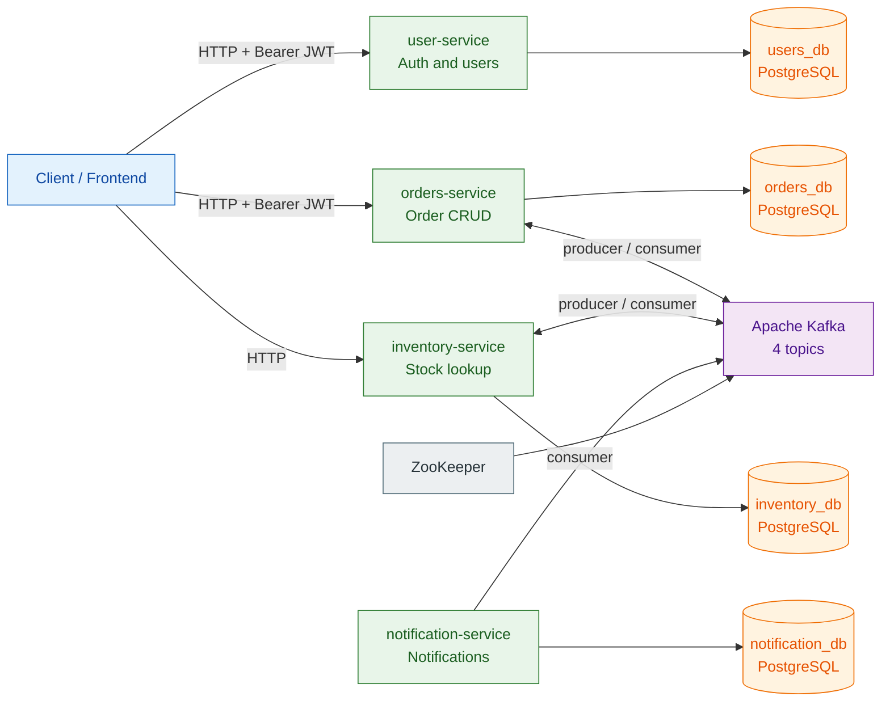
```mermaid
flowchart LR
    classDef client fill:#e3f2fd,stroke:#1565c0,color:#0d47a1
    classDef svc fill:#e8f5e9,stroke:#2e7d32,color:#1b5e20
    classDef db fill:#fff3e0,stroke:#ef6c00,color:#e65100
    classDef bus fill:#f3e5f5,stroke:#6a1b9a,color:#4a148c
    classDef ext fill:#eceff1,stroke:#546e7a,color:#263238

    Client["Client / Frontend"]:::client
    Client -->|"HTTP + Bearer JWT"| US["user-service<br/>Auth and users"]:::svc
    Client -->|"HTTP + Bearer JWT"| OS["orders-service<br/>Order CRUD"]:::svc
    Client -->|"HTTP"| IS["inventory-service<br/>Stock lookup"]:::svc

    US --> UDB[("users_db<br/>PostgreSQL")]:::db
    OS --> ODB[("orders_db<br/>PostgreSQL")]:::db
    IS --> IDB[("inventory_db<br/>PostgreSQL")]:::db
    NS["notification-service<br/>Notifications"]:::svc --> NDB[("notification_db<br/>PostgreSQL")]:::db

    OS <-->|"producer / consumer"| K["Apache Kafka<br/>4 topics"]:::bus
    IS <-->|"producer / consumer"| K
    NS -->|"consumer"| K

    ZK["ZooKeeper"]:::ext --> K
```

### Service summary

| Service | Host port | Container port | Database | Role | Security |
|---|---:|---:|---|---|---|
| `user-service` | 8084 | 8080 | `users_db` (host 5435) | Registration, login and user management | Spring Security + JWT (issuer) |
| `orders-service` | 8081 | 8080 | `orders_db` (host 5432) | Create, query and cancel orders | Spring Security + JWT (validator) |
| `inventory-service` | 8082 | 8080 | `inventory_db` (host 5433) | Stock reservation/release and public lookup | No security |
| `notification-service` | 8083 | 8080 | `notification_db` (host 5434) | Notification history persistence | No security (actuator only) |

---

## 2. System architecture

### 2.1 Deployment view

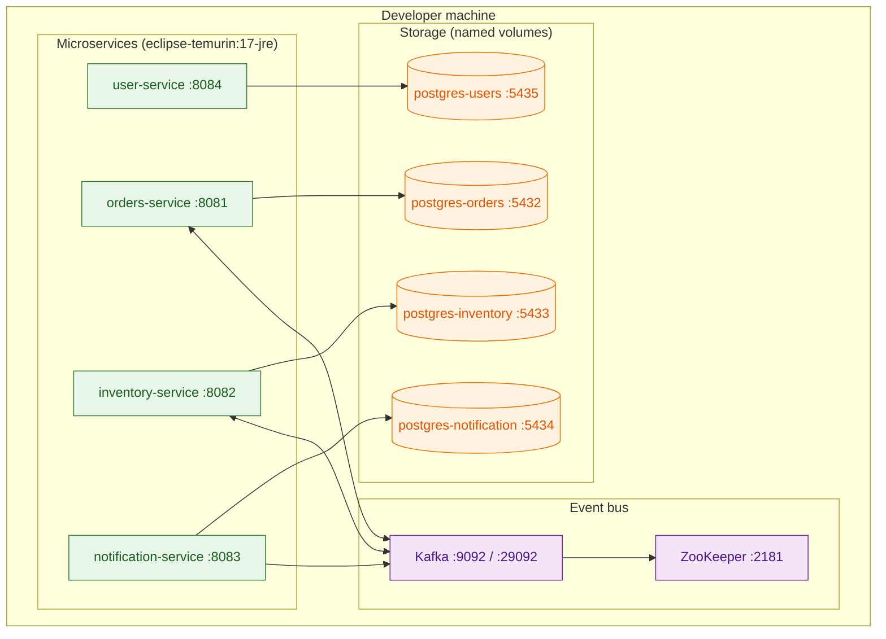
```mermaid
flowchart TD
    classDef app fill:#e8f5e9,stroke:#2e7d32,color:#1b5e20
    classDef db fill:#fff3e0,stroke:#ef6c00,color:#e65100
    classDef bus fill:#f3e5f5,stroke:#6a1b9a,color:#4a148c

    subgraph HOST["Developer machine"]
        direction LR
        subgraph APPS["Microservices (eclipse-temurin:17-jre)"]
            direction TB
            US["user-service :8084"]:::app
            OS["orders-service :8081"]:::app
            IS["inventory-service :8082"]:::app
            NS["notification-service :8083"]:::app
        end
        subgraph DATA["Storage (named volumes)"]
            direction TB
            PU[("postgres-users :5435")]:::db
            PO[("postgres-orders :5432")]:::db
            PI[("postgres-inventory :5433")]:::db
            PN[("postgres-notification :5434")]:::db
        end
        subgraph MQ["Event bus"]
            K["Kafka :9092 / :29092"]:::bus
            Z["ZooKeeper :2181"]:::bus
        end
    end

    US --> PU
    OS --> PO
    IS --> PI
    NS --> PN
    OS <--> K
    IS <--> K
    NS --> K
    K --> Z
```

### 2.2 Logical view (layers of each service)

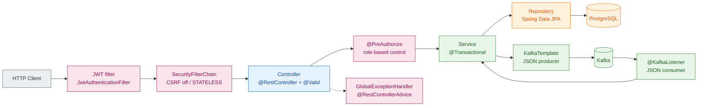
```mermaid
flowchart LR
    classDef ext fill:#eceff1,stroke:#546e7a,color:#263238
    classDef api fill:#e3f2fd,stroke:#1565c0,color:#0d47a1
    classDef sec fill:#fce4ec,stroke:#ad1457,color:#880e4f
    classDef biz fill:#e8f5e9,stroke:#2e7d32,color:#1b5e20
    classDef pers fill:#fff3e0,stroke:#ef6c00,color:#e65100

    Client["HTTP Client"]:::ext --> Filter["JWT filter<br/>JwtAuthenticationFilter"]:::sec
    Filter --> SecCfg["SecurityFilterChain<br/>CSRF off / STATELESS"]:::sec
    SecCfg --> Ctrl["Controller<br/>@RestController + @Valid"]:::api
    Ctrl --> Authz["@PreAuthorize<br/>role-based control"]:::sec
    Authz --> Svc["Service<br/>@Transactional"]:::biz
    Svc --> Repo["Repository<br/>Spring Data JPA"]:::pers
    Repo --> DB[("PostgreSQL")]:::pers
    Svc --> Pub["KafkaTemplate<br/>JSON producer"]:::biz
    Pub --> Kafka[("Kafka")]:::biz
    Kafka --> Lsn["@KafkaListener<br/>JSON consumer"]:::biz
    Lsn --> Svc
    Ctrl -.-> Exh["GlobalExceptionHandler<br/>@RestControllerAdvice"]:::sec
```

### 2.3 Patterns applied

| Pattern | Where it applies |
|---|---|
| Database per Service | 4 independent PostgreSQL instances, no shared tables |
| Choreography saga | The order is coordinated purely through events, with no central orchestrator |
| Anti-corruption layer | Each service declares its own event DTO (`OrderEvent` duplicated per module) |
| Atomic conditional update | `OrderRepository.markStatusIfActive` (`UPDATE ... WHERE status <> :status`) |
| Pessimistic locking | `StockRepository.findByProductIdForUpdate` with `@Lock(PESSIMISTIC_WRITE)` |
| Basic idempotency | Listeners ignore events if the current state is already the desired one |
| Health check + ordered startup | `/actuator/health` + `depends_on: service_healthy` in Compose |
| Uniform error contract | Envelope `{timestamp, status, message}` in user and orders |

---

## 3. Technologies

| Category | Technology | Version |
|---|---|---|
| Language | Java | 17 |
| Framework | Spring Boot | 3.2.5 |
| Build | Multi-module Maven | parent `spring-boot-starter-parent` |
| Security | Spring Security + JJWT | 3.2.5 / 0.12.5 |
| Persistence | Spring Data JPA, Hibernate, PostgreSQL | `postgresql` driver (runtime) |
| Messaging | Spring Kafka (JSON serialization) | 3.1.3 |
| Broker | Confluent Kafka + ZooKeeper | 7.5.0 |
| Database | PostgreSQL | 16-alpine |
| Mapping | MapStruct (declared, not actively used) | 1.5.5.Final |
| Resilience | Resilience4j (configured, not actively used) | 2.2.0 |
| Email | spring-boot-starter-mail (configured, disabled) | inherits from Boot |
| Utilities | Lombok | inherits from Boot |
| Testing | JUnit 5, Mockito, MockMvc, `@DataJpaTest`, H2 | inherits from Boot |
| Containers | Docker / Docker Compose (multi-stage build) | Compose Spec |
| CI | GitHub Actions | `.github/workflows/ci.yml` |
| Cloud | Spring Cloud BOM (imported, not actively used) | 2023.0.1 |

---

## 4. Repository structure

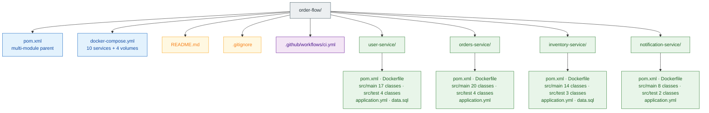
```mermaid
flowchart TD
    classDef root fill:#eceff1,stroke:#455a64,color:#263238
    classDef build fill:#e3f2fd,stroke:#1565c0,color:#0d47a1
    classDef svc fill:#e8f5e9,stroke:#2e7d32,color:#1b5e20
    classDef doc fill:#fff8e1,stroke:#f9a825,color:#f57f17
    classDef ci fill:#f3e5f5,stroke:#6a1b9a,color:#4a148c

    ROOT["order-flow/"]:::root
    ROOT --> POM["pom.xml<br/>multi-module parent"]:::build
    ROOT --> COMPOSE["docker-compose.yml<br/>10 services + 4 volumes"]:::build
    ROOT --> RM["README.md"]:::doc
    ROOT --> GI[".gitignore"]:::doc
    ROOT --> GH[".github/workflows/ci.yml"]:::ci

    ROOT --> U["user-service/"]:::svc
    ROOT --> O["orders-service/"]:::svc
    ROOT --> I["inventory-service/"]:::svc
    ROOT --> N["notification-service/"]:::svc

    U --> U1["pom.xml · Dockerfile<br/>src/main 17 classes · src/test 4 classes<br/>application.yml · data.sql"]:::svc
    O --> O1["pom.xml · Dockerfile<br/>src/main 20 classes · src/test 4 classes<br/>application.yml"]:::svc
    I --> I1["pom.xml · Dockerfile<br/>src/main 14 classes · src/test 3 classes<br/>application.yml · data.sql"]:::svc
    N --> N1["pom.xml · Dockerfile<br/>src/main 8 classes · src/test 2 classes<br/>application.yml"]:::svc
```

> **Totals**: 59 production classes + 13 test classes = **72 Java sources** (excluding `target/`).

---

## 5. Maven modules

### 5.1 Module hierarchy

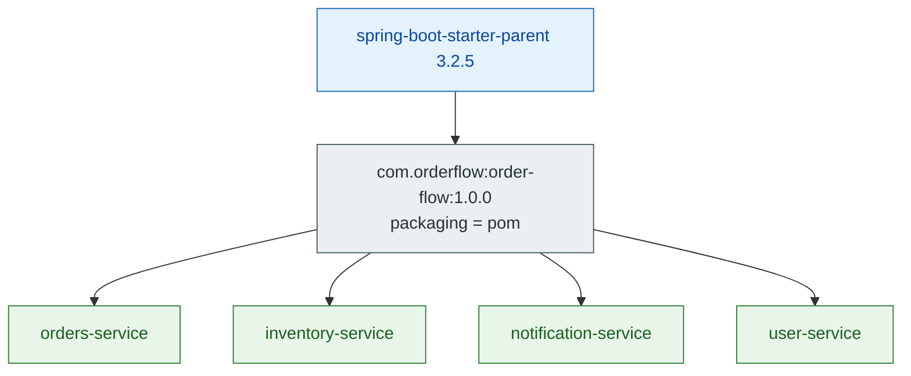
```mermaid
flowchart TD
    classDef boot fill:#e3f2fd,stroke:#1565c0,color:#0d47a1
    classDef parent fill:#eceff1,stroke:#455a64,color:#263238
    classDef mod fill:#e8f5e9,stroke:#2e7d32,color:#1b5e20

    BOOT["spring-boot-starter-parent 3.2.5"]:::boot --> P["com.orderflow:order-flow:1.0.0<br/>packaging = pom"]:::parent
    P --> M1["orders-service"]:::mod
    P --> M2["inventory-service"]:::mod
    P --> M3["notification-service"]:::mod
    P --> M4["user-service"]:::mod
```

**Root coordinates**: `com.orderflow:order-flow:1.0.0`, name `OrderFlow`, description *"Microservices-based order management system"*.

**Parent properties**

| Property | Value |
|---|---|
| `java.version` | 17 |
| `spring-cloud.version` | 2023.0.1 |
| `spring-kafka.version` | 3.1.3 |
| `resilience4j.version` | 2.2.0 |
| `jjwt.version` | 0.12.5 |
| `mapstruct.version` | 1.5.5.Final |

**`dependencyManagement`**: imports the `spring-cloud-dependencies:2023.0.1` BOM, pins `spring-kafka`, `resilience4j-spring-boot3` (*duplicate entry in the file*), `jjwt-api` / `jjwt-impl` / `jjwt-jackson` and `mapstruct`.

**Build**: `spring-boot-maven-plugin` with Lombok excluded.

### 5.2 Dependency matrix per module

| Dependency | user | orders | inventory | notification |
|---|:-:|:-:|:-:|:-:|
| `spring-boot-starter-web` | ✓ | ✓ | ✓ | ✓ |
| `spring-boot-starter-data-jpa` | ✓ | ✓ | ✓ | ✓ |
| `spring-boot-starter-security` | ✓ | ✓ | – | – |
| `spring-boot-starter-validation` | ✓ | ✓ | ✓ | – |
| `spring-boot-starter-actuator` | ✓ | ✓ | ✓ | ✓ |
| `spring-boot-starter-webflux` | – | ✓ | – | – |
| `spring-kafka` | – | ✓ | ✓ | ✓ |
| `resilience4j-spring-boot3` + `starter-aop` | – | ✓ | – | – |
| `spring-boot-starter-mail` | – | – | – | ✓ |
| `jjwt-api` / `jjwt-impl` / `jjwt-jackson` | ✓ | ✓ | – | – |
| `postgresql` (runtime) | ✓ | ✓ | ✓ | ✓ |
| `lombok` (optional) | ✓ | ✓ | ✓ | ✓ |
| `mapstruct` | – | ✓ | ✓ | – |
| `spring-boot-starter-test` (test) | ✓ | ✓ | ✓ | ✓ |
| `spring-security-test` (test) | ✓ | ✓ | – | – |
| `h2` (test) | ✓ | ✓ | ✓ | ✓ |

`orders-service` and `inventory-service` configure `maven-compiler-plugin` with `annotationProcessorPaths` (Lombok + `mapstruct-processor`).

---

## 6. Infrastructure (Docker Compose)

### 6.1 Startup dependency graph

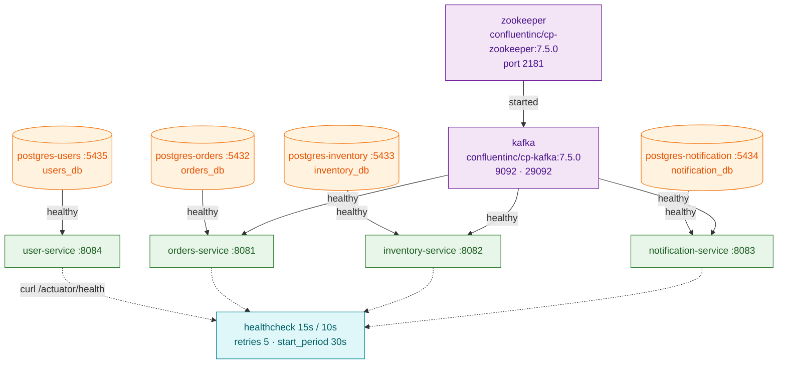
```mermaid
flowchart TD
    classDef db fill:#fff3e0,stroke:#ef6c00,color:#e65100
    classDef bus fill:#f3e5f5,stroke:#6a1b9a,color:#4a148c
    classDef app fill:#e8f5e9,stroke:#2e7d32,color:#1b5e20
    classDef health fill:#e0f7fa,stroke:#00838f,color:#006064

    ZK["zookeeper<br/>confluentinc/cp-zookeeper:7.5.0<br/>port 2181"]:::bus
    K["kafka<br/>confluentinc/cp-kafka:7.5.0<br/>9092 · 29092"]:::bus
    PU[("postgres-users :5435<br/>users_db")]:::db
    PO[("postgres-orders :5432<br/>orders_db")]:::db
    PI[("postgres-inventory :5433<br/>inventory_db")]:::db
    PN[("postgres-notification :5434<br/>notification_db")]:::db

    ZK -->|"started"| K
    PU -->|"healthy"| US["user-service :8084"]:::app
    PO -->|"healthy"| OS["orders-service :8081"]:::app
    K -->|"healthy"| OS
    PI -->|"healthy"| IS["inventory-service :8082"]:::app
    K -->|"healthy"| IS
    PN -->|"healthy"| NS["notification-service :8083"]:::app
    K -->|"healthy"| NS

    US -.->|"curl /actuator/health"| H1["healthcheck 15s / 10s<br/>retries 5 · start_period 30s"]:::health
    OS -.-> H1
    IS -.-> H1
    NS -.-> H1
```

### 6.2 Services declared in the compose file

| Compose service | Image / Build | Host port → container port | Volume | Startup condition |
|---|---|---|---|---|
| `postgres-users` | `postgres:16-alpine` | 5435 → 5432 | `postgres-users-data` | healthcheck `pg_isready` |
| `postgres-orders` | `postgres:16-alpine` | 5432 → 5432 | `postgres-orders-data` | healthcheck `pg_isready` |
| `postgres-inventory` | `postgres:16-alpine` | 5433 → 5432 | `postgres-inventory-data` | healthcheck `pg_isready` |
| `postgres-notification` | `postgres:16-alpine` | 5434 → 5432 | `postgres-notification-data` | healthcheck `pg_isready` |
| `zookeeper` | `confluentinc/cp-zookeeper:7.5.0` | 2181 → 2181 | — | `started` |
| `kafka` | `confluentinc/cp-kafka:7.5.0` | 9092, 29092 | — | `started` + healthcheck `kafka-broker-api-versions` |
| `user-service` | `build: user-service/Dockerfile` | 8084 → 8080 | — | `postgres-users: service_healthy` |
| `orders-service` | `build: orders-service/Dockerfile` | 8081 → 8080 | — | `postgres-orders` + `kafka` healthy |
| `inventory-service` | `build: inventory-service/Dockerfile` | 8082 → 8080 | — | `postgres-inventory` + `kafka` healthy |
| `notification-service` | `build: notification-service/Dockerfile` | 8083 → 8080 | — | `postgres-notification` + `kafka` healthy |

**Default PostgreSQL credentials**: user `orderflow`, password `orderflow` (all databases).

**Injected environment variables**

| Variable | Value | Services |
|---|---|---|
| `SPRING_DATASOURCE_URL` | `jdbc:postgresql://postgres-<svc>:5432/<db>` | all 4 |
| `SPRING_DATASOURCE_USERNAME` / `SPRING_DATASOURCE_PASSWORD` | `orderflow` / `orderflow` | all 4 |
| `SPRING_KAFKA_BOOTSTRAP_SERVERS` | `kafka:29092` | orders, inventory, notification |
| `JWT_SECRET` | 45-character HS256 secret | user, orders |
| `JWT_EXPIRATION` | `86400000` (24 h) | user |
| `SPRING_JPA_HIBERNATE_DDL_AUTO` | `create` | inventory, notification |

**Broker configuration in the compose file**

| Parameter | Value | Effect |
|---|---|---|
| `KAFKA_ADVERTISED_LISTENERS` | `PLAINTEXT://kafka:29092`, `PLAINTEXT_HOST://localhost:9092` | in-network and host |
| `KAFKA_OFFSETS_TOPIC_REPLICATION_FACTOR` | 1 | single broker |
| `KAFKA_AUTO_CREATE_TOPICS_ENABLE` | `true` | topics are created automatically |
| `KAFKA_ZOOKEEPER_CONNECT` | `zookeeper:2181` | ZooKeeper mode (not KRaft) |

> There is no `networks:` section (default network `order-flow_default`), no `restart:` policies, no `env_file:`, and no resource limits.

### 6.3 Dockerfile (multi-stage, identical pattern across the 4 modules)

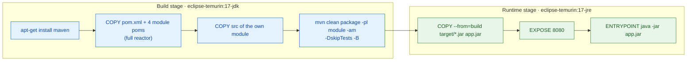
```mermaid
flowchart LR
    classDef build fill:#e3f2fd,stroke:#1565c0,color:#0d47a1
    classDef run fill:#e8f5e9,stroke:#2e7d32,color:#1b5e20

    subgraph B["Build stage · eclipse-temurin:17-jdk"]
        direction TB
        B1["apt-get install maven"]:::build
        B2["COPY pom.xml + 4 module poms<br/>(full reactor)"]:::build
        B3["COPY src of the own module"]:::build
        B4["mvn clean package -pl module -am<br/>-DskipTests -B"]:::build
        B1 --> B2 --> B3 --> B4
    end
    subgraph R["Runtime stage · eclipse-temurin:17-jre"]
        direction TB
        R1["COPY --from=build target/*.jar app.jar"]:::run
        R2["EXPOSE 8080"]:::run
        R3["ENTRYPOINT java -jar app.jar"]:::run
        R1 --> R2 --> R3
    end
    B4 --> R1
```

> There is no `.dockerignore`: the build context includes the local `target/` directories.

---

## 7. Data model

### 7.1 `users_db` — user-service

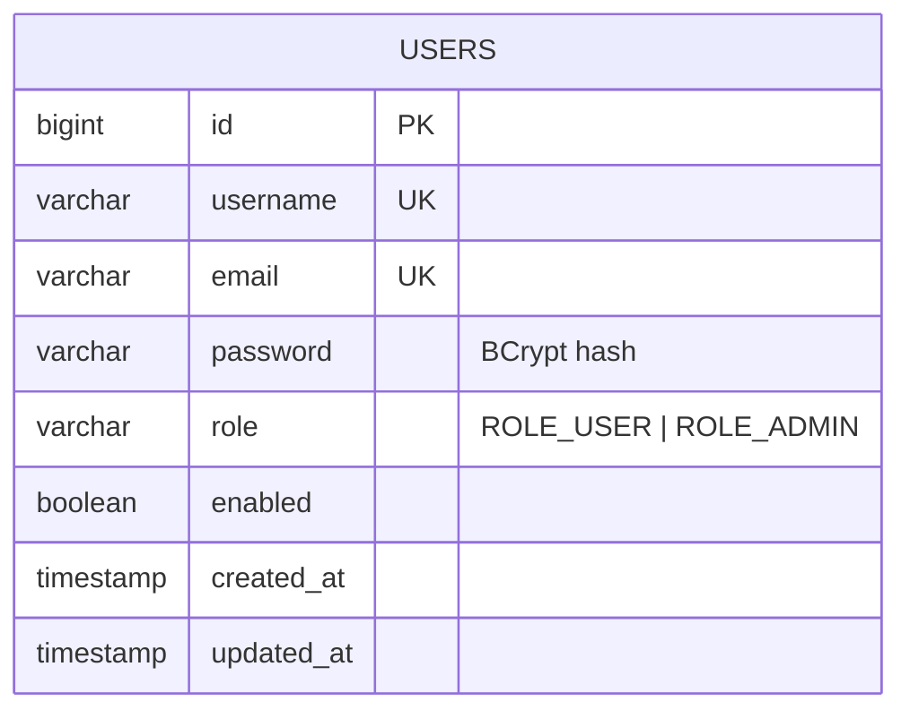
```mermaid
erDiagram
    USERS {
        bigint id PK
        varchar username UK
        varchar email UK
        varchar password "BCrypt hash"
        varchar role "ROLE_USER | ROLE_ADMIN"
        boolean enabled
        timestamp created_at
        timestamp updated_at
    }
```

- `role` is persisted with `@Enumerated(STRING)` on the `Role` enum.
- `created_at` uses `@CreationTimestamp` (not editable) and `updated_at` uses `@UpdateTimestamp`.

### 7.2 `orders_db` — orders-service

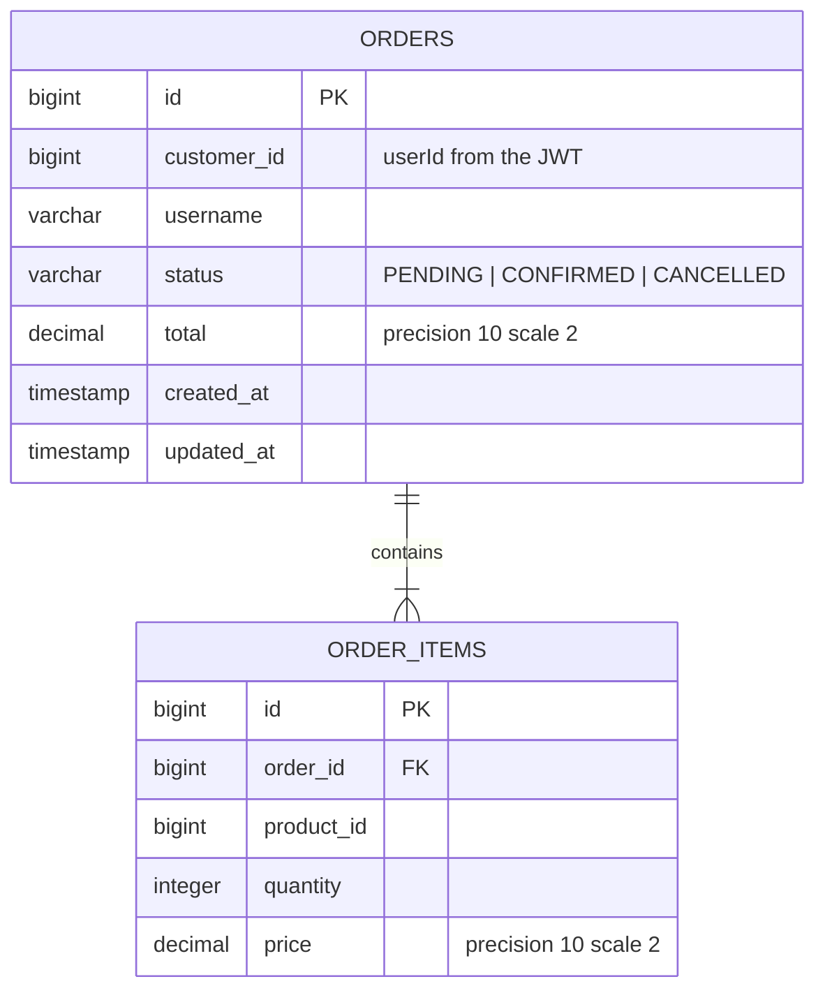
```mermaid
erDiagram
    ORDERS ||--|{ ORDER_ITEMS : "contains"
    ORDERS {
        bigint id PK
        bigint customer_id "userId from the JWT"
        varchar username
        varchar status "PENDING | CONFIRMED | CANCELLED"
        decimal total "precision 10 scale 2"
        timestamp created_at
        timestamp updated_at
    }
    ORDER_ITEMS {
        bigint id PK
        bigint order_id FK
        bigint product_id
        integer quantity
        decimal price "precision 10 scale 2"
    }
```

- Bidirectional relationship: the owning side is `ORDER_ITEMS.order` (`@ManyToOne LAZY`).
- `ORDERS.items` is `@OneToMany(mappedBy, cascade = ALL, orphanRemoval = true, fetch = EAGER)`.

### 7.3 `inventory_db` — inventory-service

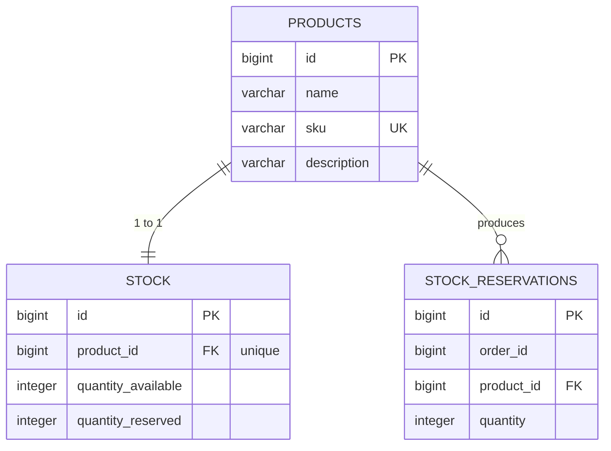
```mermaid
erDiagram
    PRODUCTS ||--|| STOCK : "1 to 1"
    PRODUCTS ||--o{ STOCK_RESERVATIONS : "produces"
    PRODUCTS {
        bigint id PK
        varchar name
        varchar sku UK
        varchar description
    }
    STOCK {
        bigint id PK
        bigint product_id FK "unique"
        integer quantity_available
        integer quantity_reserved
    }
    STOCK_RESERVATIONS {
        bigint id PK
        bigint order_id
        bigint product_id FK
        integer quantity
    }
```

- Actual available = `quantity_available - quantity_reserved`.
- `STOCK.product_id` has a `UNIQUE` constraint (OneToOne with `Product`).

### 7.4 `notification_db` — notification-service

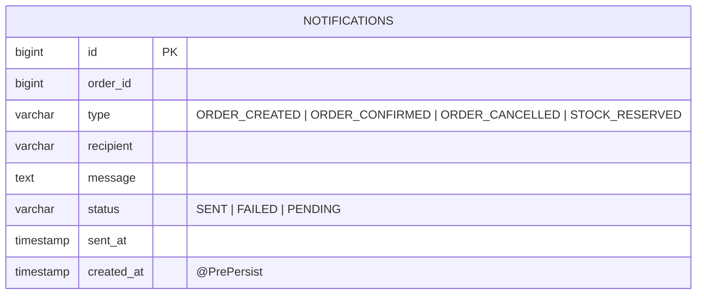
```mermaid
erDiagram
    NOTIFICATIONS {
        bigint id PK
        bigint order_id
        varchar type "ORDER_CREATED | ORDER_CONFIRMED | ORDER_CANCELLED | STOCK_RESERVED"
        varchar recipient
        text message
        varchar status "SENT | FAILED | PENDING"
        timestamp sent_at
        timestamp created_at "@PrePersist"
    }
```

- Isolated table: references the order through the `order_id` scalar, with **no JPA association** towards orders-service.

---

## 8. Domain and business logic

### 8.1 Package structure per service


```mermaid
flowchart TD
    classDef api fill:#e3f2fd,stroke:#1565c0,color:#0d47a1
    classDef biz fill:#e8f5e9,stroke:#2e7d32,color:#1b5e20
    classDef pers fill:#fff3e0,stroke:#ef6c00,color:#e65100
    classDef sec fill:#fce4ec,stroke:#ad1457,color:#880e4f
    classDef evt fill:#f3e5f5,stroke:#6a1b9a,color:#4a148c

    subgraph US["com.orderflow.user"]
        U1["controller/UserController"]:::api
        U2["service/UserService<br/>service/CustomUserDetailsService"]:::biz
        U3["repository/UserRepository"]:::pers
        U4["domain/User · Role"]:::pers
        U5["security/JwtUtil · JwtAuthenticationFilter<br/>config/SecurityConfig"]:::sec
        U6["dto/* · exception/*"]:::api
        U1 --> U2 --> U3 --> U4
        U5 --> U1
        U6 --> U1
    end

    subgraph OS["com.orderflow.orders"]
        O1["controller/OrderController"]:::api
        O2["service/OrderService"]:::biz
        O3["repository/OrderRepository"]:::pers
        O4["domain/Order · OrderItem · OrderStatus"]:::pers
        O5["security/* · config/SecurityConfig"]:::sec
        O6["event/OrderEventPublisher"]:::evt
        O7["listener/StockEventListener"]:::evt
        O1 --> O2 --> O3 --> O4
        O2 --> O6
        O7 --> O2
        O5 --> O1
    end

    subgraph IS["com.orderflow.inventory"]
        I1["controller/InventoryController"]:::api
        I2["service/InventoryService"]:::biz
        I3["repository/ProductRepository<br/>StockRepository · StockReservationRepository"]:::pers
        I4["domain/Product · Stock · StockReservation"]:::pers
        I5["event/StockEventPublisher"]:::evt
        I6["listener/OrderCreatedListener<br/>OrderCancelledListener"]:::evt
        I1 --> I2 --> I3 --> I4
        I2 --> I5
        I6 --> I2
    end

    subgraph NS["com.orderflow.notification"]
        N1["no controller"]:::api
        N2["service/NotificationService"]:::biz
        N3["repository/NotificationRepository"]:::pers
        N4["domain/Notification · NotificationType · NotificationStatus"]:::pers
        N5["listener/OrderEventListener"]:::evt
        N5 --> N2 --> N3 --> N4
    end
```

### 8.2 user-service

| Class | Responsibility |
|---|---|
| `UserService` | `register` (validates uniqueness, BCrypt-hashes, generates JWT), `login` (via `AuthenticationManager`), user queries |
| `CustomUserDetailsService` | Adapter to `UserDetailsService`; exposes `role` as authority and `enabled` as `disabled` |
| `JwtUtil` | HS256 signing/validation, claims `sub`, `role`, `userId`, `iat`, `exp`; rejects non-canonical tokens and `alg:none` |
| `JwtAuthenticationFilter` | Extracts `Authorization: Bearer`, validates and sets the **username (`String`)** as the principal |
| `SecurityConfig` | Stateless chain, public routes, `BCryptPasswordEncoder`, `AuthenticationManager` |
| `GlobalExceptionHandler` | Envelope `{timestamp, status, message \| errors}` |

**Business rules**

- Registration rejects duplicate username and email with `409`.
- Every new user is born with `ROLE_USER` and `enabled = true`.
- Validations: username 3–50 characters, email valid format, password at least 6 characters.

### 8.3 orders-service

| Class | Responsibility |
|---|---|
| `OrderService` | Create, query, cancel and react to stock events |
| `OrderEventPublisher` | Publishes `order-created` and `order-cancelled` with key `orderId` |
| `StockEventListener` | Consumes `stock-reserved` and `stock-rejected` (group `orders-service`) |
| `OrderRepository.markStatusIfActive` | Conditional and atomic state transition |
| `AuthenticatedUser` | `record(id, username, role)` as the security context principal |

**Business rules**

- The unit price is **hardcoded to `99.99`** (there is no price catalog).
- `total = Σ (price × quantity)`.
- Creating an order leaves it in `PENDING` and publishes `order-created`.
- `handleStockReserved`: if the order is `CANCELLED` it is ignored (idempotency); otherwise it moves to `CONFIRMED`.
- `handleStockRejected`: if already `CANCELLED` it is ignored; otherwise it is set to `CANCELLED` and publishes `order-cancelled` so inventory releases reservations.
- `cancelOrder`: double check (read + `UPDATE ... WHERE status <> 'CANCELLED'`) to win races; if `0` rows are affected → `409`.
- Authorization: only the order owner or a `ROLE_ADMIN` can read or cancel it.

### 8.4 inventory-service

| Class | Responsibility |
|---|---|
| `InventoryService.processOrderCreated` | Aggregates demand per product, validates with pessimistic locking, reserves or rejects |
| `InventoryService.releaseReservations` | Releases stock and deletes reservations upon receiving `order-cancelled` |
| `InventoryService.getAvailableStock` | `quantityAvailable - quantityReserved`, or `0` if it does not exist |
| `StockRepository.findByProductIdForUpdate` | `@Lock(PESSIMISTIC_WRITE)` at row level |
| `StockEventPublisher` | Publishes `stock-reserved` and `stock-rejected` |

**Reservation algorithm**

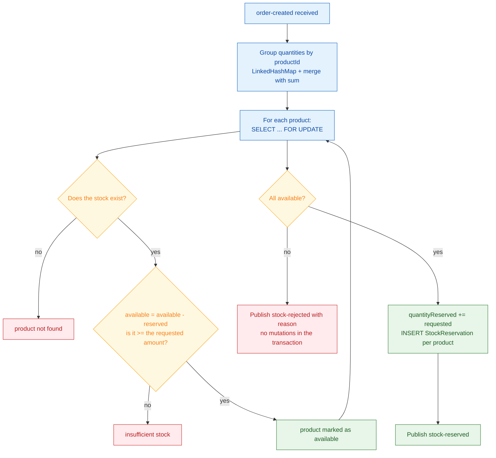
```mermaid
flowchart TD
    classDef in fill:#e3f2fd,stroke:#1565c0,color:#0d47a1
    classDef dec fill:#fff8e1,stroke:#f9a825,color:#f57f17
    classDef ok fill:#e8f5e9,stroke:#2e7d32,color:#1b5e20
    classDef ko fill:#ffebee,stroke:#c62828,color:#b71c1c

    A["order-created received"]:::in --> B["Group quantities by productId<br/>LinkedHashMap + merge with sum"]:::in
    B --> C["For each product:<br/>SELECT ... FOR UPDATE"]:::in
    C --> D{"Does the stock exist?"}:::dec
    D -->|"no"| R1["product not found"]:::ko
    D -->|"yes"| E{"available = available - reserved<br/>is it >= the requested amount?"}:::dec
    E -->|"no"| R2["insufficient stock"]:::ko
    E -->|"yes"| F["product marked as available"]:::ok
    F --> C
    C --> G{"All available?"}:::dec
    G -->|"no"| REJ["Publish stock-rejected with reason<br/>no mutations in the transaction"]:::ko
    G -->|"yes"| H["quantityReserved += requested<br/>INSERT StockReservation per product"]:::ok
    H --> I["Publish stock-reserved"]:::ok
```

> If any product fails, the transaction has not written anything yet, so the rejection is committed with no side effects.

### 8.5 notification-service

No controllers: only `@KafkaListener` and persistence.

| Event | Method | Persisted type | Simulated recipient | Message |
|---|---|---|---|---|
| `order-created` | `sendOrderCreatedNotification` | `ORDER_CREATED` | `customer-<id>@orderflow.com` | `Order #<id> created successfully by customer <id>` |
| `order-cancelled` | `sendOrderCancelledNotification` | `ORDER_CANCELLED` | `customer-<id>@orderflow.com` | `Order #<id> of customer <id> has been cancelled` |
| `stock-reserved` | `sendStockReservedNotification` | `ORDER_CONFIRMED` | `inventory@orderflow.com` | `Order #<id> confirmed - stock reserved successfully` |

All of them are saved with `status = SENT` and `sentAt = now`. Actual SMTP delivery is **disabled** (`notification.email.enabled: false`).

---

## 9. Authentication and authorization (JWT)

### 9.1 Authentication cycle

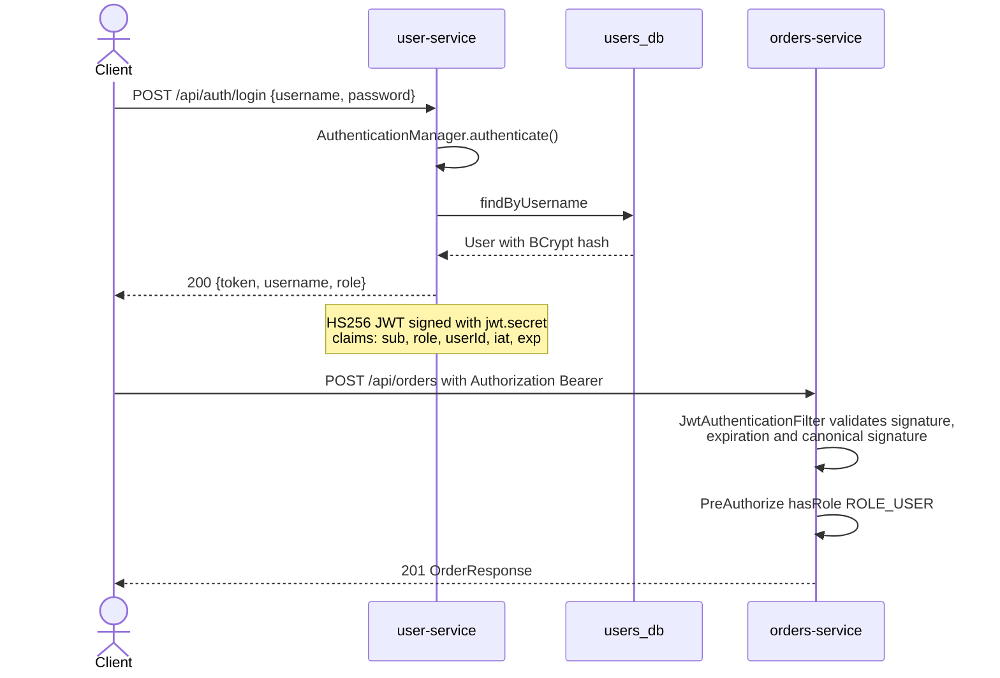
```mermaid
sequenceDiagram
    actor C as Client
    participant API as user-service
    participant DB as users_db
    participant ORD as orders-service

    C->>API: POST /api/auth/login {username, password}
    API->>API: AuthenticationManager.authenticate()
    API->>DB: findByUsername
    DB-->>API: User with BCrypt hash
    API-->>C: 200 {token, username, role}
    Note over API: HS256 JWT signed with jwt.secret<br/>claims: sub, role, userId, iat, exp
    C->>ORD: POST /api/orders with Authorization Bearer
    ORD->>ORD: JwtAuthenticationFilter validates signature,<br/>expiration and canonical signature
    ORD->>ORD: PreAuthorize hasRole ROLE_USER
    ORD-->>C: 201 OrderResponse
```

### 9.2 Token specification

| Attribute | Value |
|---|---|
| Algorithm | HS256 (`Keys.hmacShaKeyFor`) |
| Secret | `mySecretKeyThatIsAtLeast32BytesLongForHS256Algorithm!` (identical in user and orders) |
| Expiration | `jwt.expiration = 86400000` ms (24 h), only on issuance |
| Claims | `sub` = username, `role`, `userId`, `iat`, `exp` |
| Protections | Rejects tokens with more than 3 segments, non-canonical signature (malleability), `alg:none`, wrong secret and expired token |

### 9.3 Differences between issuer and validator

| Aspect | user-service | orders-service |
|---|---|---|
| Role in the project | Issuer + its own validator | External validator (no login endpoint) |
| `SecurityContext` principal | `String` (username) | `AuthenticatedUser(id, username, role)` |
| `userId` in the filter | optional | **mandatory**: if `null` it does not authenticate |
| Reading the `userId` claim | `Number.longValue()` | `Long.class` directly |
| `jwt.expiration` | used to sign | not configured (only validates) |
| `PasswordEncoder` / `AuthenticationManager` | present | absent |

### 9.4 Authorization decision tree

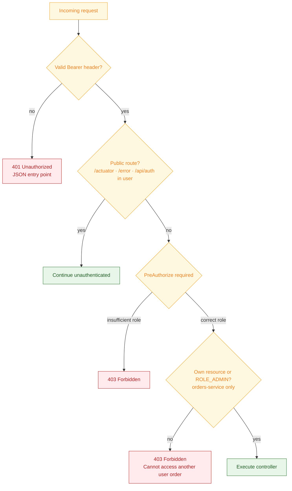
```mermaid
flowchart TD
    classDef ok fill:#e8f5e9,stroke:#2e7d32,color:#1b5e20
    classDef ko fill:#ffebee,stroke:#c62828,color:#b71c1c
    classDef q fill:#fff8e1,stroke:#f9a825,color:#f57f17

    A["Incoming request"]:::q --> B{"Valid Bearer header?"}:::q
    B -->|"no"| E401["401 Unauthorized<br/>JSON entry point"]:::ko
    B -->|"yes"| C{"Public route?<br/>/actuator · /error · /api/auth in user"}:::q
    C -->|"yes"| OK1["Continue unauthenticated"]:::ok
    C -->|"no"| D{"PreAuthorize required"}:::q
    D -->|"insufficient role"| E403["403 Forbidden"]:::ko
    D -->|"correct role"| E{"Own resource or ROLE_ADMIN?<br/>orders-service only"}:::q
    E -->|"no"| E403B["403 Forbidden<br/>Cannot access another user order"]:::ko
    E -->|"yes"| OK2["Execute controller"]:::ok
```

> `inventory-service` and `notification-service` **do not depend on Spring Security**: their endpoints (if any) and the actuator remain open.

### 9.5 Route and role matrix

| Service | Route | Method | Access |
|---|---|---|---|
| user | `/api/auth/register` | POST | public |
| user | `/api/auth/login` | POST | public |
| user | `/api/users/me` | GET | `ROLE_USER` |
| user | `/api/users/{id}` | GET | `ROLE_USER` |
| user | `/api/users` | GET | `ROLE_ADMIN` |
| user | `/actuator/**`, `/error` | GET | public |
| orders | `/api/orders` | POST | `ROLE_USER` |
| orders | `/api/orders/{id}` | GET | `ROLE_USER` + owner or `ROLE_ADMIN` |
| orders | `/api/orders` | GET | `ROLE_USER` (own list) |
| orders | `/api/orders/{id}/cancel` | PUT | `ROLE_USER` + owner or `ROLE_ADMIN` |
| orders | `/actuator/**`, `/error` | GET | public |
| inventory | `/api/inventory/{productId}/stock` | GET | open (no security) |
| notification | — | — | no HTTP endpoints |

---

## 10. REST API

### 10.1 user-service — `http://localhost:8084`

| Method | Route | Body | Response | Codes |
|---|---|---|---|---|
| POST | `/api/auth/register` | `RegisterRequest` | `AuthResponse` | 201, 400, 409 |
| POST | `/api/auth/login` | `LoginRequest` | `AuthResponse` | 200, 400, 401 |
| GET | `/api/users/{id}` | — | `UserResponse` | 200, 400, 401, 403, 404 |
| GET | `/api/users` | — | `List<UserResponse>` | 200, 401, 403 |
| GET | `/api/users/me` | — | `UserResponse` | 200, 401, 403 |

**DTOs**

```json
// RegisterRequest
{ "username": "alice", "email": "alice@orderflow.com", "password": "secret123" }

// LoginRequest
{ "username": "alice", "password": "secret123" }

// AuthResponse
{ "token": "eyJhbGciOi...", "username": "alice", "role": "ROLE_USER" }

// UserResponse
{ "id": 3, "username": "alice", "email": "alice@orderflow.com",
  "role": "ROLE_USER", "enabled": true, "createdAt": "2026-09-23T19:15:00" }
```

**Validations**: `username` 3–50 characters, `email` format, `password` ≥ 6, required fields.

### 10.2 orders-service — `http://localhost:8081`

| Method | Route | Body | Response | Codes |
|---|---|---|---|---|
| POST | `/api/orders` | `CreateOrderRequest` | `OrderResponse` | 201, 400, 401, 403 |
| GET | `/api/orders/{id}` | — | `OrderResponse` | 200, 400, 401, 403, 404 |
| GET | `/api/orders` | — | `List<OrderResponse>` | 200, 401, 403 |
| PUT | `/api/orders/{id}/cancel` | — | `OrderResponse` | 200, 401, 403, 404, 409 |

**DTOs**

```json
// CreateOrderRequest
{ "items": [ { "productId": 1, "quantity": 2 }, { "productId": 3, "quantity": 1 } ] }

// OrderResponse
{ "id": 10, "customerId": 3, "username": "alice", "status": "PENDING",
  "total": 299.97,
  "items": [ { "id": 1, "productId": 1, "quantity": 2, "price": 99.99 } ],
  "createdAt": "2026-09-23T19:20:00", "updatedAt": "2026-09-23T19:20:00" }
```

**Validations**: `items` not empty, null/negative `productId` rejected, null or non-positive `quantity` rejected.

### 10.3 inventory-service — `http://localhost:8082`

| Method | Route | Response | Codes |
|---|---|---|---|
| GET | `/api/inventory/{productId}/stock` | `{"productId": 3, "availableQuantity": 150}` | 200, 400 (non-numeric id) |

### 10.4 notification-service — `http://localhost:8083`

No business endpoints. It only exposes `/actuator/health` and `/actuator/info`.

---

## 11. Asynchronous messaging (Kafka)

### 11.1 Topic topology

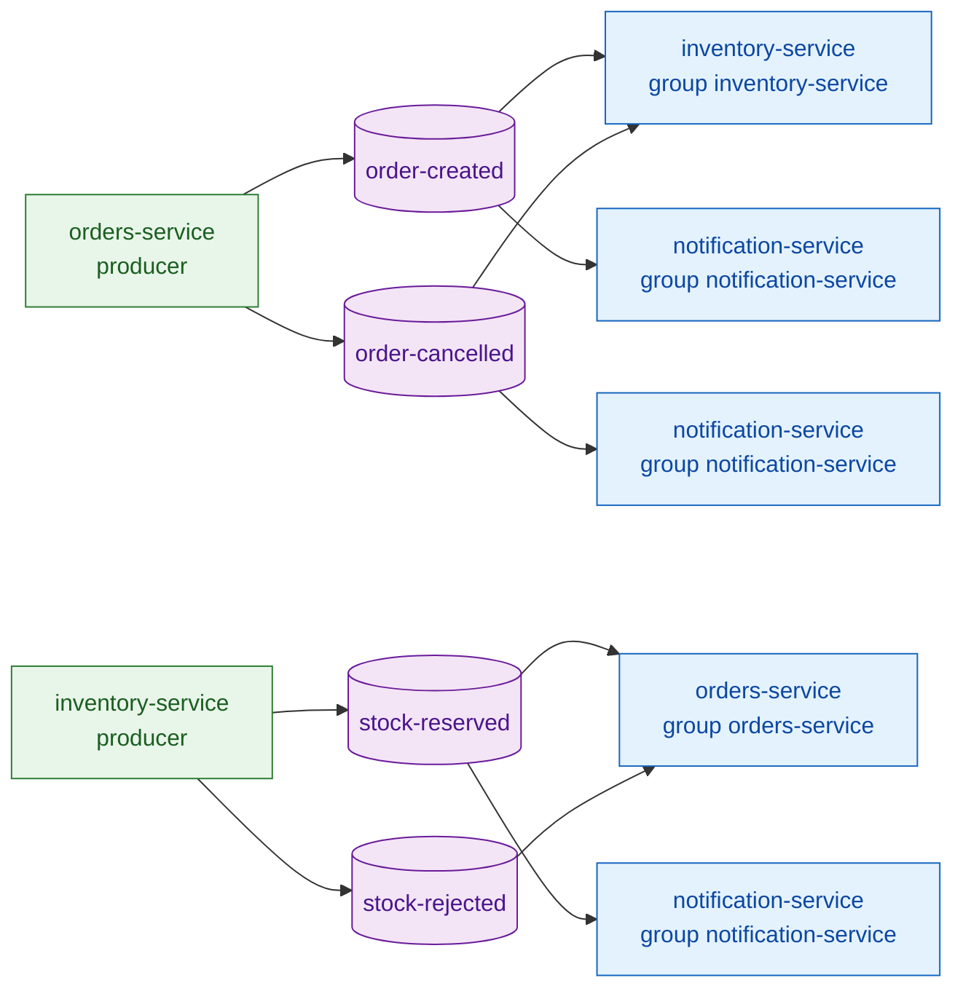
```mermaid
flowchart LR
    classDef prod fill:#e8f5e9,stroke:#2e7d32,color:#1b5e20
    classDef cons fill:#e3f2fd,stroke:#1565c0,color:#0d47a1
    classDef topic fill:#f3e5f5,stroke:#6a1b9a,color:#4a148c

    OS["orders-service<br/>producer"]:::prod
    IS["inventory-service<br/>producer"]:::prod

    T1[("order-created")]:::topic
    T2[("order-cancelled")]:::topic
    T3[("stock-reserved")]:::topic
    T4[("stock-rejected")]:::topic

    IS2["inventory-service<br/>group inventory-service"]:::cons
    NS1["notification-service<br/>group notification-service"]:::cons
    NS2["notification-service<br/>group notification-service"]:::cons
    NS3["notification-service<br/>group notification-service"]:::cons
    OS2["orders-service<br/>group orders-service"]:::cons

    OS --> T1
    OS --> T2
    IS --> T3
    IS --> T4

    T1 --> IS2
    T1 --> NS1
    T2 --> IS2
    T2 --> NS2
    T3 --> OS2
    T3 --> NS3
    T4 --> OS2
```

### 11.2 Event contract

| Topic | Producer | Key | Payload | Consumers (group) |
|---|---|---|---|---|
| `order-created` | orders `OrderEventPublisher` | `orderId` | `OrderEvent` | inventory (`inventory-service`), notification (`notification-service`) |
| `order-cancelled` | orders `OrderEventPublisher` | `orderId` | `OrderEvent` | inventory (`inventory-service`), notification (`notification-service`) |
| `stock-reserved` | inventory `StockEventPublisher` | `orderId` | `StockEvent` | orders (`orders-service`), notification (`notification-service`) |
| `stock-rejected` | inventory `StockEventPublisher` | `orderId` | `StockEvent` | orders (`orders-service`) |

**Payload schema**

```json
// OrderEvent (published by orders-service, includes username)
{ "orderId": 10, "customerId": 3, "username": "alice",
  "items": [ { "productId": 1, "quantity": 2 } ],
  "timestamp": "2026-09-23T19:20:00" }

// StockEvent
{ "orderId": 10, "reason": "Insufficient stock for product 4. Available: 30, Requested: 50.",
  "timestamp": "2026-09-23T19:20:01" }
```

### 11.3 Serialization

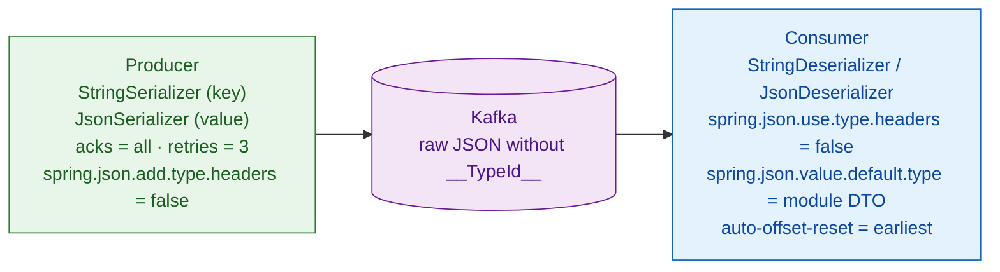
```mermaid
flowchart LR
    classDef a fill:#e8f5e9,stroke:#2e7d32,color:#1b5e20
    classDef b fill:#f3e5f5,stroke:#6a1b9a,color:#4a148c
    classDef c fill:#e3f2fd,stroke:#1565c0,color:#0d47a1

    P["Producer<br/>StringSerializer (key)<br/>JsonSerializer (value)<br/>acks = all · retries = 3<br/>spring.json.add.type.headers = false"]:::a --> B[("Kafka<br/>raw JSON without __TypeId__")]:::b
    B --> C["Consumer<br/>StringDeserializer / JsonDeserializer<br/>spring.json.use.type.headers = false<br/>spring.json.value.default.type = module DTO<br/>auto-offset-reset = earliest"]:::c
```

Each service declares its **own** `OrderEvent` class, so the type is resolved by configuration (`spring.json.value.default.type`) rather than by headers.

### 11.4 Contract compatibility note

- The `OrderEvent` of orders-service includes `username`; the copies in inventory and notification **do not declare it** (field ignored on deserialization).
- notification-service deserializes `stock-reserved` (a `StockEvent`) using its own `OrderEvent` type: `orderId` and `timestamp` match, `reason` is discarded and `customerId` stays `null`.

---

## 12. Business flows

### 12.1 Order lifecycle

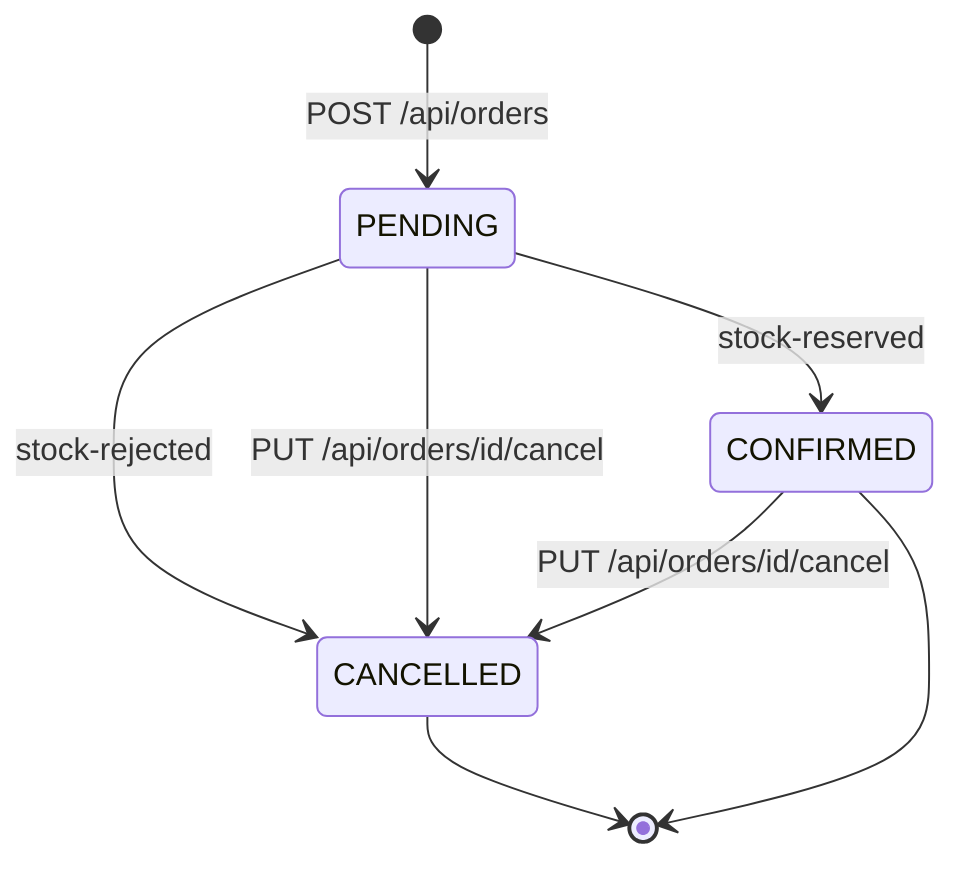
```mermaid
stateDiagram-v2
    [*] --> PENDING : POST /api/orders
    PENDING --> CONFIRMED : stock-reserved
    PENDING --> CANCELLED : stock-rejected
    PENDING --> CANCELLED : PUT /api/orders/id/cancel
    CONFIRMED --> CANCELLED : PUT /api/orders/id/cancel
    CANCELLED --> [*]
    CONFIRMED --> [*]
```

### 12.2 Happy path: creation and confirmation

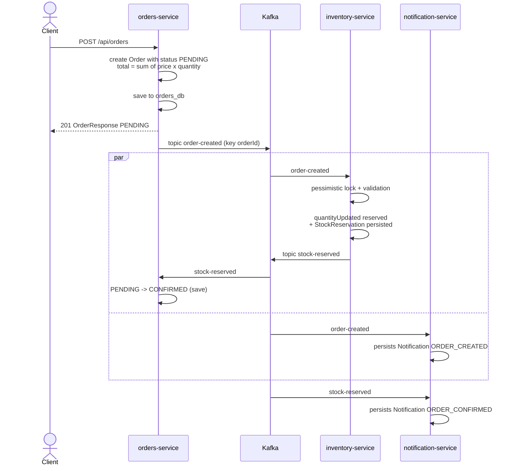
```mermaid
sequenceDiagram
    actor C as Client
    participant OS as orders-service
    participant K as Kafka
    participant IS as inventory-service
    participant NS as notification-service

    C->>OS: POST /api/orders
    OS->>OS: create Order with status PENDING<br/>total = sum of price x quantity
    OS->>OS: save to orders_db
    OS-->>C: 201 OrderResponse PENDING
    OS->>K: topic order-created (key orderId)
    par
        K->>IS: order-created
        IS->>IS: pessimistic lock + validation
        IS->>IS: quantityUpdated reserved<br/>+ StockReservation persisted
        IS->>K: topic stock-reserved
        K->>OS: stock-reserved
        OS->>OS: PENDING -> CONFIRMED (save)
    and
        K->>NS: order-created
        NS->>NS: persists Notification ORDER_CREATED
    end
    K->>NS: stock-reserved
    NS->>NS: persists Notification ORDER_CONFIRMED
```

### 12.3 Rejection branch due to insufficient stock

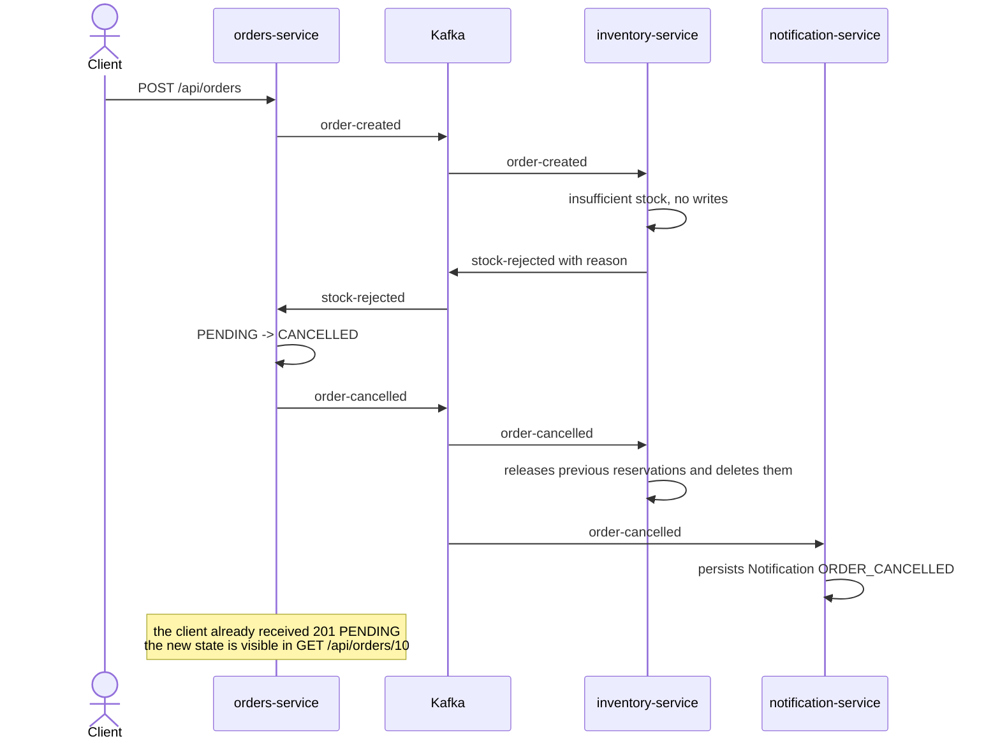
```mermaid
sequenceDiagram
    actor C as Client
    participant OS as orders-service
    participant K as Kafka
    participant IS as inventory-service
    participant NS as notification-service

    C->>OS: POST /api/orders
    OS->>K: order-created
    K->>IS: order-created
    IS->>IS: insufficient stock, no writes
    IS->>K: stock-rejected with reason
    K->>OS: stock-rejected
    OS->>OS: PENDING -> CANCELLED
    OS->>K: order-cancelled
    K->>IS: order-cancelled
    IS->>IS: releases previous reservations and deletes them
    K->>NS: order-cancelled
    NS->>NS: persists Notification ORDER_CANCELLED
    Note over OS: the client already received 201 PENDING<br/>the new state is visible in GET /api/orders/10
```

### 12.4 Cancellation by the user

```mermaid
sequenceDiagram
    actor C as Client
    participant OS as orders-service
    participant K as Kafka
    participant IS as inventory-service
    participant NS as notification-service

    C->>OS: PUT /api/orders/10/cancel
    OS->>OS: verify order ownership
    OS->>OS: UPDATE status = CANCELLED<br/>WHERE status <> CANCELLED
    alt rows affected = 0
        OS-->>C: 409 IllegalOrderStateException
    else rows affected = 1
        OS->>K: order-cancelled
        OS-->>C: 200 OrderResponse CANCELLED
        par
            K->>IS: order-cancelled
            IS->>IS: quantityReserved decreased<br/>+ StockReservation deleted
        and
            K->>NS: order-cancelled
            NS->>NS: persists Notification ORDER_CANCELLED
        end
    end
```

### 12.5 Stock release

```mermaid
flowchart TD
    classDef in fill:#e3f2fd,stroke:#1565c0,color:#0d47a1
    classDef ok fill:#e8f5e9,stroke:#2e7d32,color:#1b5e20
    classDef db fill:#fff3e0,stroke:#ef6c00,color:#e65100

    A["order-cancelled received"]:::in --> B["findByOrderId on stock_reservations"]:::in
    B --> C{"Any reservations?"}:::in
    C -->|"no"| F["no effect"]:::ok
    C -->|"yes"| D["For each reservation:<br/>quantityReserved -= min(reserved, quantity)"]:::in
    D --> E[("UPDATE stock")]:::db
    E --> G[("DELETE stock_reservations")]:::db
    G --> F
```

---

## 13. Error handling

### 13.1 Standard envelope

```mermaid
flowchart LR
    classDef a fill:#e3f2fd,stroke:#1565c0,color:#0d47a1
    classDef b fill:#ffebee,stroke:#c62828,color:#b71c1c

    Req["Invalid request"]:::a --> Exh["GlobalExceptionHandler<br/>@RestControllerAdvice"]:::a
    Exh --> B1["Field validation<br/>{timestamp, status: 400, errors}"]:::b
    Exh --> B2["Missing resource<br/>{timestamp, status: 404, message}"]:::b
    Exh --> B3["State or resource conflict<br/>{timestamp, status: 409, message}"]:::b
    Exh --> B4["Unauthenticated / denied<br/>{timestamp, status: 401 or 403, message}"]:::b
    Exh --> B5["Unexpected error<br/>{timestamp, status: 500, message}"]:::b
```

**Body example**

```json
{
  "timestamp": "2026-09-23T19:20:00",
  "status": 400,
  "message": "Validation failed",
  "errors": { "items[0].quantity": "Quantity must be positive" }
}
```

### 13.2 Status code matrix per service

| Condition | user-service | orders-service | inventory | notification |
|---|---|---|---|---|
| Failed `@Valid` validation | 400 + `errors` | 400 + `errors` | 400 (default) | n/a |
| Malformed / unreadable body | 400 | 400 | 400 (default) | n/a |
| Invalid parameter type | 400 | 400 | 400 (default) | n/a |
| Unsupported HTTP method | 405 (default) | 405 explicit | 405 (default) | 405 (default) |
| Unsupported Content-Type | 415 (default) | 415 explicit | 415 (default) | 415 (default) |
| Unauthenticated | 401 own JSON | 401 own JSON | — (open) | — |
| Insufficient role | 403 | 403 | — | — |
| Missing resource | 404 `UserNotFoundException` | 404 `OrderNotFoundException` | — | — |
| Duplicate username/email | 409 `UserAlreadyExistsException` | — | — | — |
| Invalid order state | — | 409 `IllegalOrderStateException` | — | — |
| Unexpected error | 500 (`RuntimeException`) | 500 (`RuntimeException`) | 500 (default) | 500 (default) |

**Custom exceptions**

| Service | Exception | HTTP | Message |
|---|---|---|---|
| user | `UserNotFoundException` | 404 | `User not found: <id or username>` |
| user | `UserAlreadyExistsException` | 409 | `Username already exists: <u>` / `Email already exists: <e>` |
| orders | `OrderNotFoundException` | 404 | `Order not found: <id>` |
| orders | `IllegalOrderStateException` | 409 | `Order <id> is already cancelled` |

---

## 14. Configuration

### 14.1 Configuration files

```mermaid
flowchart TD
    classDef main fill:#e3f2fd,stroke:#1565c0,color:#0d47a1
    classDef test fill:#fff8e1,stroke:#f9a825,color:#f57f17
    classDef env fill:#e8f5e9,stroke:#2e7d32,color:#1b5e20

    Y["application.yml<br/>(per module, port 8080)"]:::main --> OVR["Compose environment variables<br/>SPRING_* · JWT_*"]:::env
    YT["application-test.yml<br/>test profile with in-memory H2"]:::test --> T["@ActiveProfiles test<br/>in test classes"]:::test
    OVR --> RUN["Container runtime"]:::env
```

### 14.2 Main keys per module

| Key | user | orders | inventory | notification |
|---|---|---|---|---|
| `server.port` | 8080 | 8080 | 8080 | 8080 |
| `spring.datasource.url` | `localhost:5432/users_db` | `localhost:5432/orders_db` | `localhost:5432/inventory_db` | `localhost:5432/notification_db` |
| `spring.jpa.hibernate.ddl-auto` | `update` | `update` | `update` (compose: `create`) | `update` (compose: `create`) |
| `spring.jpa.show-sql` | true | true | true | true |
| `defer-datasource-initialization` | true | — | true | — |
| `spring.sql.init.mode` | `always` | — | `always` | — |
| `spring.sql.init.continue-on-error` | true | — | — | — |
| `spring.kafka.bootstrap-servers` | — | `localhost:9092` | `localhost:9092` | `localhost:9092` |
| `spring.kafka.consumer.group-id` | — | `orders-service` | `inventory-service` | `notification-service` |
| `spring.kafka.consumer.spring.json.value.default.type` | — | `...orders.dto.StockEvent` | `...inventory.dto.OrderEvent` | `...notification.dto.OrderEvent` |
| `jwt.secret` | ✓ | ✓ | — | — |
| `jwt.expiration` | 86400000 | — | — | — |
| `spring.mail.*` | — | — | — | `smtp.gmail.com:587` |
| `notification.email.enabled` | — | — | — | `false` |
| `resilience4j.circuitbreaker.instances.inventoryService` | — | ✓ (unused in code) | — | — |
| `management.endpoints.web.exposure.include` | `health,info` | `health,info` | `health,info` | `health,info` |

> **Warning**: user-service's `application.yml` points to `localhost:5432/users_db`, but the compose file publishes that database on port **5435** (5432 belongs to orders). When running locally without Docker you must override `SPRING_DATASOURCE_URL`.

### 14.3 Test profile

All 4 modules define `src/test/resources/application-test.yml`:

| Key | Value |
|---|---|
| `spring.datasource.url` | `jdbc:h2:mem:testdb;DB_CLOSE_DELAY=-1` |
| `spring.datasource.username` / `password` | `sa` / empty |
| `spring.jpa.hibernate.ddl-auto` | `create-drop` |
| `spring.jpa.database-platform` | `org.hibernate.dialect.H2Dialect` |
| `spring.sql.init.mode` | `never` (only in user and inventory) |

---

## 15. Seed data

### 15.1 user-service — `src/main/resources/data.sql`

| username | email | role | password |
|---|---|---|---|
| `admin` | `admin@orderflow.com` | `ROLE_ADMIN` | `password` |
| `user` | `user@orderflow.com` | `ROLE_USER` | `password` |

Both are inserted with the same BCrypt hash (`$2a$10$sZmX1dJyR5cp7BLv7W8RvezamttWVaQE/Y4uMb46vjcoAcJWwVMf.`) and `enabled = true`. It runs with `spring.sql.init.mode: always` + `defer-datasource-initialization: true` and `continue-on-error: true` (safe to repeat with `ddl-auto: update`).

### 15.2 inventory-service — `src/main/resources/data.sql`

```mermaid
flowchart LR
    classDef p fill:#e8f5e9,stroke:#2e7d32,color:#1b5e20
    classDef s fill:#fff3e0,stroke:#ef6c00,color:#e65100

    P1["1 HP Laptop<br/>LAP-HP-001"]:::p --> S1["stock 50"]:::s
    P2["2 Logitech Mouse<br/>MOU-LOG-001"]:::p --> S2["stock 200"]:::s
    P3["3 Mechanical Keyboard<br/>KEY-MEC-001"]:::p --> S3["stock 150"]:::s
    P4["4 Samsung Monitor<br/>MON-SAM-001"]:::p --> S4["stock 30"]:::s
    P5["5 Sony Headphones<br/>AUD-SON-001"]:::p --> S5["stock 100"]:::s
    P6["6 Logitech Webcam<br/>WEC-LOG-001"]:::p --> S6["stock 80"]:::s
    P7["7 Samsung SSD<br/>SSD-SAM-001"]:::p --> S7["stock 120"]:::s
    P8["8 Kingston RAM<br/>RAM-KIN-001"]:::p --> S8["stock 200"]:::s
    P9["9 HDMI Cable<br/>CAB-HDM-001"]:::p --> S9["stock 500"]:::s
    P10["10 XL Mousepad<br/>MPA-XL-001"]:::p --> S10["stock 300"]:::s
```

All of them start with `quantity_reserved = 0`. In the compose file this service starts with `ddl-auto: create`, so the seed is cleanly regenerated after `docker compose down -v`.

---

## 16. Quick start

### 16.1 Requirements

| Requirement | Version |
|---|---|
| Docker + Docker Compose | 20.10+ / Compose v2 |
| (local alternative) JDK | 17 |
| (local alternative) Maven | 3.9+ |
| (local alternative) PostgreSQL and Kafka | 16 and 3.x |

### 16.2 Full startup (recommended)

```bash
docker compose up --build -d
docker compose ps
```

```mermaid
flowchart LR
    classDef a fill:#e3f2fd,stroke:#1565c0,color:#0d47a1
    classDef b fill:#e8f5e9,stroke:#2e7d32,color:#1b5e20

    A["docker compose up --build -d"]:::a --> B["Postgres x4 + ZooKeeper + Kafka"]:::a
    B --> C["user :8084 · orders :8081<br/>inventory :8082 · notification :8083"]:::b
    C --> D["Verify:<br/>curl localhost:8084/actuator/health"]:::b
```

### 16.3 Health URLs

| Service | URL |
|---|---|
| user-service | `http://localhost:8084/actuator/health` |
| orders-service | `http://localhost:8081/actuator/health` |
| inventory-service | `http://localhost:8082/actuator/health` |
| notification-service | `http://localhost:8083/actuator/health` |

### 16.4 Useful commands

```bash
# View logs of a service
docker compose logs -f orders-service

# Stop everything keeping data
docker compose down

# Stop everything and delete volumes (regenerates the seeds)
docker compose down -v

# Rebuild a single image
docker compose build orders-service

# Run the tests without Docker
mvn -ntp clean test

# Package a specific module
mvn -pl user-service -am clean package -DskipTests
```

### 16.5 Local run without Docker

```mermaid
sequenceDiagram
    participant D as Developer
    participant PG as local PostgreSQL
    participant K as local Kafka
    participant M as Maven

    D->>PG: create databases users_db, orders_db,<br/>inventory_db, notification_db
    D->>K: start broker on localhost:9092
    D->>M: mvn -pl user-service -am spring-boot:run
    Note over D,M: override SPRING_DATASOURCE_URL<br/>because user-service expects port 5435
    D->>M: mvn -pl orders-service -am spring-boot:run
    D->>M: mvn -pl inventory-service -am spring-boot:run
    D->>M: mvn -pl notification-service -am spring-boot:run
```

---

## 17. curl examples

```bash
# 1) Login
TOKEN=$(curl -s -X POST http://localhost:8084/api/auth/login \
  -H "Content-Type: application/json" \
  -d '{"username":"user","password":"password"}' | jq -r .token)

# 2) Registration
curl -s -X POST http://localhost:8084/api/auth/register \
  -H "Content-Type: application/json" \
  -d '{"username":"alice","email":"alice@orderflow.com","password":"secret123"}'

# 3) Own profile
curl -s http://localhost:8084/api/users/me -H "Authorization: Bearer $TOKEN"

# 4) Create order
curl -s -X POST http://localhost:8081/api/orders \
  -H "Content-Type: application/json" \
  -H "Authorization: Bearer $TOKEN" \
  -d '{"items":[{"productId":1,"quantity":2},{"productId":3,"quantity":1}]}'

# 5) Get order
curl -s http://localhost:8081/api/orders/1 -H "Authorization: Bearer $TOKEN"

# 6) List my orders
curl -s http://localhost:8081/api/orders -H "Authorization: Bearer $TOKEN"

# 7) Cancel order
curl -s -X PUT http://localhost:8081/api/orders/1/cancel \
  -H "Authorization: Bearer $TOKEN"

# 8) Get available stock
curl -s http://localhost:8082/api/inventory/1/stock

# 9) Service health
for p in 8084 8081 8082 8083; do curl -s localhost:$p/actuator/health; done
```

---

## 18. Testing

### 18.1 Strategy

```mermaid
flowchart TD
    classDef unit fill:#e3f2fd,stroke:#1565c0,color:#0d47a1
    classDef web fill:#f3e5f5,stroke:#6a1b9a,color:#4a148c
    classDef repo fill:#fff3e0,stroke:#ef6c00,color:#e65100
    classDef sec fill:#fce4ec,stroke:#ad1457,color:#880e4f

    T["mvn clean verify"] --> A["Unit tests with Mockito<br/>services and JwtUtil"]:::unit
    T --> B["Web slice with MockMvc<br/>controllers + security"]:::web
    T --> C["@DataJpaTest with H2<br/>repositories and queries"]:::repo
    T --> D["JWT security<br/>signature, expiration, alg:none"]:::sec
    A --> E["test profile: in-memory H2<br/>ddl-auto create-drop"]:::repo
    B --> E
    C --> E
    D --> E
```

### 18.2 Test inventory

| Module | Test class | Type | Count |
|---|---|---|---:|
| user | `UserControllerIntegrationTest` | `@SpringBootTest` + MockMvc | 13 |
| user | `JwtUtilTest` | JWT unit test | 7 |
| user | `UserServiceTest` | Mockito | 6 |
| user | `UserRepositoryTest` | `@DataJpaTest` | 2 |
| orders | `OrderControllerWebMvcTest` | `@WebMvcTest` + security | 13 |
| orders | `OrderServiceTest` | Mockito | 9 |
| orders | `JwtUtilTest` | JWT unit test | 7 |
| orders | `OrderRepositoryTest` | `@DataJpaTest` | 3 |
| inventory | `InventoryServiceTest` | Mockito | 7 |
| inventory | `InventoryControllerWebMvcTest` | `@WebMvcTest` | 2 |
| inventory | `StockRepositoryTest` | `@DataJpaTest` | 1 |
| notification | `NotificationServiceTest` | Mockito | 3 |
| notification | `NotificationRepositoryTest` | `@DataJpaTest` | 2 |
| **Total** | **13 classes** | | **75** |

### 18.3 Cases covered per area

```mermaid
mindmap
  root(("75 tests"))
    Authentication
      Duplicate registration 409
      Login and wrong password 401
      Own vs foreign token
      Tampered / expired / alg none token
      USER and ADMIN roles
    Orders
      Total calculation
      order-created publication
      Single cancellation
      Race on cancellation
      Stock confirmation and rejection
    Inventory
      Duplicate aggregation
      Reservation with pessimistic lock
      Insufficient stock and missing product
      Reservation release
    Notifications
      ORDER_CREATED persistence
      ORDER_CANCELLED and ORDER_CONFIRMED
      createdAt set on PrePersist
```

### 18.4 Execution

```bash
mvn -ntp clean test            # all modules
mvn -ntp -pl user-service test # a specific module
mvn -B -ntp clean verify       # as in CI (includes package)
```

Reports are generated in `*/target/surefire-reports/`.

---

## 19. CI/CD (GitHub Actions)

### 19.1 Pipeline

```mermaid
flowchart LR
    classDef trig fill:#eceff1,stroke:#455a64,color:#263238
    classDef job fill:#e3f2fd,stroke:#1565c0,color:#0d47a1
    classDef art fill:#fff8e1,stroke:#f9a825,color:#f57f17
    classDef img fill:#e8f5e9,stroke:#2e7d32,color:#1b5e20

    E1["push to main"]:::trig --> J1
    E2["pull request to main"]:::trig --> J1
    subgraph J1["Job: test · Build and tests"]
        direction TB
        T1["actions/checkout@v4"]:::job
        T2["actions/setup-java@v4<br/>temurin 17 + maven cache"]:::job
        T3["mvn -B -ntp clean verify"]:::job
        T1 --> T2 --> T3
    end
    T3 --> U["upload-artifact surefire-reports<br/>if: always()"]:::art
    J1 -->|"needs: test"| J2
    subgraph J2["Job: docker · Image build"]
        direction TB
        D1["docker build user-service"]:::img
        D2["docker build orders-service"]:::img
        D3["docker build inventory-service"]:::img
        D4["docker build notification-service"]:::img
    end
    J2 --> TAG["orderflow-*-service:ci"]:::img
```

| Job | Runner | Steps | Output |
|---|---|---|---|
| `test` (*Build and tests*) | `ubuntu-latest` | checkout → Java 17 temurin with Maven cache → `mvn -B -ntp clean verify` → uploads `**/target/surefire-reports/**` even on failure | Surefire reports |
| `docker` (*Docker image build*) | `ubuntu-latest` | 4 `docker build` tagged `orderflow-<svc>:ci` | local images (no push to a registry) |

**Triggers**: `push` and `pull_request` on the `main` branch. There is no automatic deployment, no matrix and no path filters.

---

## 20. Design decisions

| Decision | Justification |
|---|---|
| DB per service | Data isolation and independent deployment; the order is referenced only by a scalar |
| Choreography saga with Kafka | No single orchestrator as a single point of failure; each service reacts to events |
| Pessimistic locking on stock | Availability is checked and reserved in the same transaction, preventing overselling |
| Conditional update on orders | Avoids the race between user cancellation and the stock response |
| Idempotency in listeners | Kafka redeliveries or retries do not cause double confirmations or double releases |
| Shared stateless JWT | user-service issues and orders-service validates with the same secret, with no session or cache |
| Explicit JSON type via configuration | `spring.json.value.default.type` avoids depending on `__TypeId__` headers between services |
| Seed data in `data.sql` | Reproducible startup for demos and manual testing |
| Actuator in all 4 services | Compose healthchecks and observability are uniform |

---

## 21. Known limitations and improvements

### 21.1 Observed in the current code

```mermaid
flowchart TD
    classDef hi fill:#ffebee,stroke:#c62828,color:#b71c1c
    classDef med fill:#fff8e1,stroke:#f9a825,color:#f57f17
    classDef lo fill:#e8f5e9,stroke:#2e7d32,color:#1b5e20

    SEC["Security"]:::hi --> S1["JWT_SECRET hardcoded<br/>in application.yml and in the compose file"]:::hi
    SEC --> S2["inventory and notification without Spring Security"]:::hi
    SEC --> S3["User seeding with a weak admin account"]:::med

    BUS["Messaging and consistency"]:::med --> B1["No retries or DLQ<br/>in the listeners"]:::med
    BUS --> B2["Divergent event contracts<br/>(username optional)"]:::med
    BUS --> B3["No transactional outbox:<br/>save + publish is not atomic"]:::hi

    CFG["Configuration"]:::lo --> C1["user-service points to localhost:5432<br/>but the compose publishes 5435"]:::med
    CFG --> C2["ddl-auto update/create mixed<br/>without migrations (Flyway/Liquibase)"]:::med
    CFG --> C3["No .dockerignore or .env"]:::lo

    DEAD["Unused code"]:::lo --> D1["Resilience4j configured but unused"]:::lo
    DEAD --> D2["WebFlux and MapStruct declared but unused"]:::lo
    DEAD --> D3["spring-boot-starter-mail and SMTP inactive"]:::lo
    DEAD --> D4["spring-cloud BOM imported but unused"]:::lo
    DEAD --> D5["Duplicate entry in dependencyManagement"]:::lo

    BIZ["Business model"]:::med --> Z1["Fixed price 99.99<br/>no catalog"]:::hi
    BIZ --> Z2["No minimum stock or expiring reservations"]:::med
    BIZ --> Z3["notification without HTTP lookup<br/>of the history"]:::lo
```

### 21.2 Prioritized recommendations

| Priority | Improvement | Scope |
|---|---|---|
| High | Move `JWT_SECRET` to environment variables / a secrets manager | user, orders, compose |
| High | Introduce *outbox* transactions for `save` + `publish` | orders, inventory |
| High | Add retry handling, `DefaultErrorHandler` and dead-letter topics | the 3 consumers |
| High | Unify the `OrderEvent` contract in a shared module or schema registry | all |
| Medium | Add Flyway/Liquibase and remove `ddl-auto` from production | all |
| Medium | Protect `inventory-service` with JWT or hide it behind a gateway | inventory |
| Medium | Fix the JDBC port of user-service for local runs | user |
| Medium | Implement real email sending and enable the `notification.email.enabled` flag | notification |
| Medium | Add `.dockerignore` and a Maven dependency layer in the Dockerfiles | build |
| Low | Apply Resilience4j to cross-service calls or drop the dependency | orders |
| Low | Publish images to a registry and add a deployment stage in CI | CI/CD |
| Low | Document/OpenAPI with springdoc for the 3 REST APIs | user, orders, inventory |
